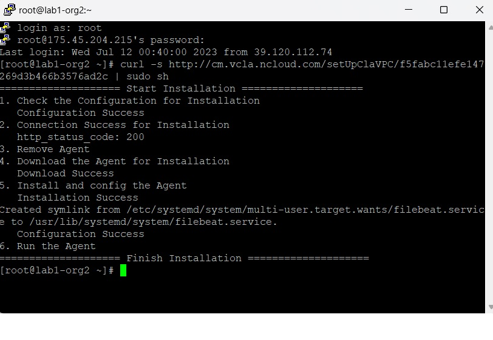

## Preview
Load Balancer 및 Auto-scaling 
여러 대의 Server에게 균등하게 Traffic을 분산시켜주는 역할을 하는 것이 Load Balancer

 
Load Balancing이란?

하나의 인터넷 서비스가 발생하는 트래픽이 많을 때 여러 대의 서버가 분산처리하여 서버의 로드율 증가, 부하량, 속도저하 등을 고려하여 적절히 분산처리하여 해결해주는 서비스

 
NAT(Network Address Translation)

사설 IP 주소를 공인 IP 주소로 바꾸는 데 사용하는 통신망의 주소 변조기

 
Tunneling

인터넷상에서 눈에 보이지 않는 통로를 만들어 통신할 수 있게 하는 개념
데이터를 캡슐화해서 연결된 상호 간에만 캡슐화된 패킷을 구별해 캡슐화를 해제할 수 있다.

 
DSR(Dynamic Source Routing protocol)

로드 밸런서 사용 시 서버에서 클라이언트로 되돌아가는 경우 목적지 주소를 스위치의 IP 주소가 아닌 클라이언트의 IP 주소로 전달해서 네트워크 스위치를 거치지 않고 바로 클라이언트를 찾아가는 개념

### 8강
## 오브젝트 스토리지 활용
Obejct Stroage란?
객체 기반의 무제한 파일 저장 스토리지

콘솔, RESTful API, SDK 등의 다양한 방법으로 오브젝트들을 관리하고, 저장된 파일은 각 파일마다 고유한 접근 URL이 부여되어 인터넷상에서 여러 사용자가 쉽게 접근 가능

정적 웹사이트 호스팅 가능

객체 스토리지는 객체라고 하는 비정형 형식으로 데이터를 저장하고 관리하는 기술입니다. 현대적인 조직에서는 사진, 동영상, 이메일, 웹 페이지, 센서 데이터 및 오디오 파일과 같은 다량의 비정형 데이터를 생성하고 분석

  

### 9강
## 데이터베이스
Cloud DB for MySQL
자동 Fail-Over, 자동 백업 설정을 자동으로 하고 있음
Redis
Redis란?
Key, Value 구조의 비정형 데이터를 저장하고 관리하기 위한 오픈 소스 기반의 비관계형 데이터베이스 관리 시스템(DBMS)
데이터베이스, 캐시, 메세지 브로커로 사용되며 인메모리데이터 구조를 가진 저장소

안정적인 서비스 제공을 위해 장애 발생 시 자동 Fail-over 기능 제공(Principal DB와 Mirror DB 총 2대 생성)
Principal Server가 장애가 발생하면 Mirror Server가 Principal DB로 올라오면서 지속적으로 고가용성을 유지하는 기능을 제공함

Cloud DB for MS-SQL

  

