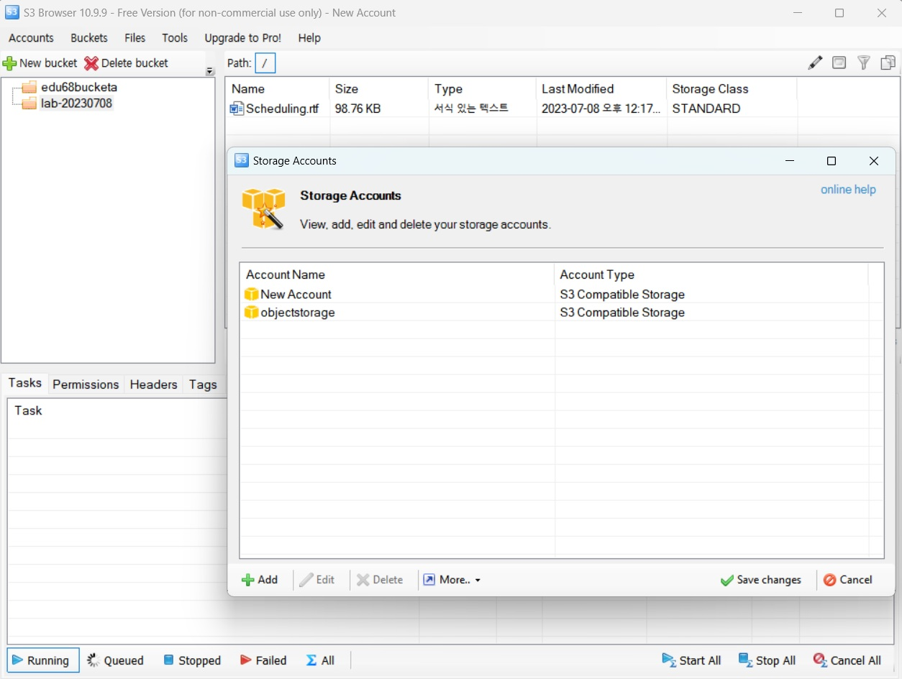

## 7강
### ⛳Load Balancer  
Target Group을 먼저 설정하고 해당 Target Group에 대해서 Load Balancing을 하게 된다
  * 타겟 그룹 안에 있는 서버를 다른 타겟 그룹에 속하게 할 수 있지만 타겟 그룹을 다수의 로드 밸런서에 연결할 수는 없다

알고리즘은 3가지 제공
  * Round Robin : 클라이언트에서 요청이 오면 서버에 1개씩 분배하는 방식
  * Least Connection : 클라이언트 연결이 제일 적은 서버에게 새로운 커넥션을 분배하는 방식
  * Source IP Hash : 클라이언트 IP에 대한 해시테이블을 가지고 클라이언트 IP에 매핑되는 서버에 새로운 커넥션을 분배하는 방식

    
1. 애플리케이션 로드밸런서
 * HTTP, HTTPS를 사용하는 웹 애플리케이션에 보다 유연한 구성이 가능
 * 고정 IP 제공
 * URL 기반 제공

2. 네트워크 로드밸런서
 * 고성능의 분산처리 가능
 * Client IP가 그대로 로깅
 * 알고리즘은 Hash, RR만 제공

3. 네트워크 프록시 로드밸런서
 * Classic과 유사한 Proxy 로드밸런서

#### Load Balancer  
L7(Application Layer)기능 제공 - 애플리케이션 로드밸런서  
HTTP/HTTPS 트래픽에 대해서 패킷 헤더를 확인하여 Application 레벨에서의 분기처리를 제공한다. 로드밸런서의 리스너에 Host Header 기반 분기처리, URL Path Pattern 기반 분기처리, 가중치 기반 분기처리 , Redirection 응답처리와 같은 규칙이 지원되어 보다 상세한 고급 서비스 구성이 가능하다  

#### Load Balancer 모니터링  
로드밸런서에 대해서는 기본 모니터링 정보를 제공하며 서버 모니터링과 마찬가지로 기간 선택에 따라 모니터링 정보 수집 주기를 1분, 5분, 2시간, 1일 단위로 제공한다.   
네트워크 로드밸런서 모니터링은 Concurrent Connection, 초당 Connection, Traffic in, (Un)Available hosts 등 5가지 항목의 정보를 제공하며, 애플리케이션 로드밸런서는 Traffic Out을 포함하여 6가지 항목을 제공한다  

#### Load Balancer 포트 설정  
여러 개의 로드밸런서 규칙을 동시에 설정할 수 있다. 로드밸런서 규칙을 설정할 때는 로드밸런서 포트를 다른 로드밸런서 규칙의 포트와 다르게 설정해야 한다. 서버 포트는 다른 로드밸런서 규칙의 서버 포트와 동일하게 설정해도 된다.  

Network Load Balancer : Inbound에 대해서는 로드밸런서가 중개를 하지만 Outbound에 대해서는 서버가 클라이언트한테 직접 traffic을 전달하게 된다
DNS : 글로벌 dns로 제공될 것
외부의 Legacy에서의 운영되고 있는 서버를 origin 서버로 구성할 수도 있다

CDN  
실제 서버의 부하를 줄여서 traffic 비용은 동일하지만 origin 서버의 비용을 줄일 수 있고, 사용자 입장에서 훨씬 빠른 latency를 추가시킬 수 있다

## 8강
1. Load Balancer 설정하기
2. 로드밸런서 타겟그룹을 설정하게 됨
3. lab-tg로 이름 설정함
4. 리스너 : 로드밸런서가 어떤 프로토콜을 수신대기하고 있을지에 대한 설정
5. Global DNS 설정
6. CDN 설정   

## 9강

IPSEC VPN  
-vpc로도 제공될 예정이다   
고객의 VPN 장비와 NCP VPN 장비 간 터널링 연결 제공(통신 방식 호환이 되어야 함)   
NCP 서버들은 Private Subnet 대역(102.168.x.x)으로 통신 필요   
BW 최대 30Mbps 제공 (10M,20M,30Mbps)   
  
은행, 금융권에서 통신할 때   
해당 통신사에서 방화벽을 운영하게 되면 해당 IP를 알려달라고 해야한다   
그런데 이 공인 IP가 일반적인 outtraffic의 경우에는 변하게 됨 → 고정할 필요가 있는데 이 때 쓰이는게 NAT Gateway이다   
나가는 공인 IP를 구매한다고 생각하면 되고 그 때 라우터 설정을 통해서 금융권이나 통신사에 나갈 경우에 대해서만 NAT Gateway를 통해 나가는 것으로 설정하면 된다   
autoscaling으로 서버가 늘어난 경우엔 서버 그룹 안에 NAT Gateway 설정란이 있다   

### NAT Gateway

비공인 IP를 가진 다수의 서버에게 대표 공인 IP를 이용한 외부 접속을 제공
 * NAT Gateway를 통해 외부로 접속할 때 사용되는 대표 공인 IP는 해당 NAT Gateway만 독점적으로 사용하는 IP
 * Auto Scaling과 연계된 자동 설정 제공
 * 보안상 다수의 공인 IP에 대한 ACL을 오픈할 수 없는 경우 혹은 공인 IP 생성 비용 절약 가능

Global Route Manager   
Local이 아니라 Global로 서비스를 구성하고자 할 때  
DNS 기반의 다양한 방법을 통해 네트워크 트래픽을 안정적으로 로드밸런싱하는 GSLB 상품  
IP에 대한 Health Check만 제공 (GSLB에서 Health Check를 해서 고장난 IP외의 다른 IP를 제공함)
DNS 기반의 로드밸런싱 서비스 제공을 통해서 지역별 트래픽 기반 부하 부산, DR 구축 등에 사용할 수 있는 상품
로드밸런싱 타입은 4가지 제공 (Round Robin, Weighted, GeoLocation, Failover)

IP에 대한 Health Check 제공
[싱가포르, 일본, 미국에서 우리나라 서비스 페이지에 접근하면
싱가포르에 있는 IP, 일본, 미국에 있는 서버의 IP를 리턴하게 됨]

## 10강
오토스케일링을 직접 구성할 것

AutoScaling
Lauch Configuration : 어떤 서버를 만들지 부터 생각하게 됨
Auto Scaling Group : 서버를 몇대 씩 만들지, 몇 대씩 줄일지

기대 용량 : 처음 시작할 때 만들어지는 서버 수
서버가 올라오더라도 서버가 여러가지 동작을 할텐데 그것을 감안해서 몇 초 정도 더 기다려주고 정상이라 체크할 것인지
쿨다운 기본값(초), 헬스 체크 보류 기간

event rule 생성

## 11강
Storage 서비스 소개

Object Storage   
Storage : 가격이 저렴하고 사용이 편리해야 할텐데 요구조건 만족하는게 Object Storage   
인터넷상에 원하는 데이터를 저장하고 사용할 수 있도록 구축된 오브젝트 스토리지   
객체 기반의 무제한 파일 저장 스토리지   

콘솔, RESTful API, SDK 등의 다양한 방법으로 오브젝트들을 고나리하고, 저장된 파일은 각 파일마다 고유한 접근 URL이 부여되어 인터넷상에서 여러 사용자가 쉽게 접근 가능   
정적 웹 사이트 호스팅 가능   

Object Storage 특징
S3 Compatibility API 지원
Data Lifecycle 지원 [오래된 파일들을 data life cycle를 통해서 좀 더 저렴한 Archive storage로 자동으로 넘길 수 있다. 비용적으로 좀 더 저렴하게 storage를 이용할 수 있는 것]
Sub Account 와의 연동으로 접근 제어 가능 [서버 account와의 연동으로 접근제어가 가능]
CDN, Transcoder, Image Optimizer, Cloud Hadoop, Cloud Log Analytics와 같은 NCP 내 다양한 상품과 통합/연계 지원

[Archive Storage]
Hot Storage : 읽기와 쓰기가 빈번한 스토리지
Cold Storage : 읽기를 하는데 빈도수가 현저히 낮아진, 팔레트 법칙에 의해서 오래된 데이터는 잘 안 읽게 되는 스토리지 → Archive storage 빈도수가 높은 스토리지로 전환한다
Object Storage보다 데이터 저장비용은 저렴하고 데이터 API비용은 비싸게 된다
성능은 Object Storage보다는 좀 더 떨어지지만 비용적으로 유리하기 때문에 데이터를 오래 보관할 수 있다. 중요한 데이터이기 때문에 사용할 가능성이 있는 걸 저장함

데이터 아카이빙 및 장기 백업에 최적화된 스토리지 서비스

Infrequent Data 백업 및 Archiving Data 보관을 주 목적으로 하는 스토리지
Object Storage보다 데이터 저장 비용은 저렴, 데이터 처리 API 비용은 비쌈

[Archive Storage 특집]
콘솔, API(swift, s3), CLI, SDK를 이용해 데이터 관리 가능
데이터 최소 보관 기간없이 사용할 수 있음(AWS 의 glacier와 대조)
오브젝트 생명주기 관리
Sub Account 연동을 통한 권한 관리 기능 제공

NAS  : 우리나라의 시스템 엔지니어가 가장 사랑하는 스토리지 중 하나
시스템에서 이용하기가 굉장히 편리
다수의 서버에서 공유하여 사용할 수 있는 스토리지
최소 500GB에서 10TB까지 구성 가능, 추가는 100GB단위로 추가 가능
NAS 가용량 안에서 생성된 스냅샷 이미지 이용해서 데이터에 대한 복구 기능 제공

프로토콜은 NFS/CIFS 제공
서버 사설IP 이용한 ACL 오픈으로 타 계정 서버에도 마운트하여 사용 가능
기본적으로 NFS는 IP로 제어를 하고 CIFS는 ID와 PW로 접근제어를 한다

Block Storage는 네이버 클라우드 플랫폼에서 추가스토리지로 제공되는 것

추가 스토리지 : 동적으로 늘릴 수가 있다!
볼륨을 늘릴 수 있는데 다만 줄일 순 없다

NAS는 스냅샷 기능을 제공하고 있고 NAS 공간에 대해서 공간이 꽉 찬다는 이벤트 알림 설정 → 알람을 받을 수 있다

추가 스토리지 : os에 종속적이기 때문에 공유는 불가능
NAS 최초,최소 500GB 100GB 단위 증가해야 한다는 단점이 존재

Data Teleporter
작은 캐비넷, 캐리어같은 형태를 띄고 있음
대용량 데이터를 이전하고자 할 때
대용량 데이터 이전을 위한 효과적인 솔루션

네이버 클라우드 플랫폼에서 백업을 제공하는 것과 우리가 백업을 수행하는 것의 차이점 :
백업된 데이터에 대해서 복원 했을 때 그 책임이 100% restore된다 → guarantee를 네이버 클라우드 플랫폼에서 할 것이냐
고객이 할 것이냐의 차이로 보면 된다

백업된 데이터에 대한 정확성
보통은 데이터베이스를 많이 백업을 하는데, 8가지 옵션을 제공한다.

## 12강
네이버 클라우드 플랫폼의 스토리지
실제 lab을 통해서 어떻게 구성하는지 살펴볼 것.
API나 sdk를 이용해서 접근할 때는 버킷까지 써야만 버킷까지 접근하게 되어있다
