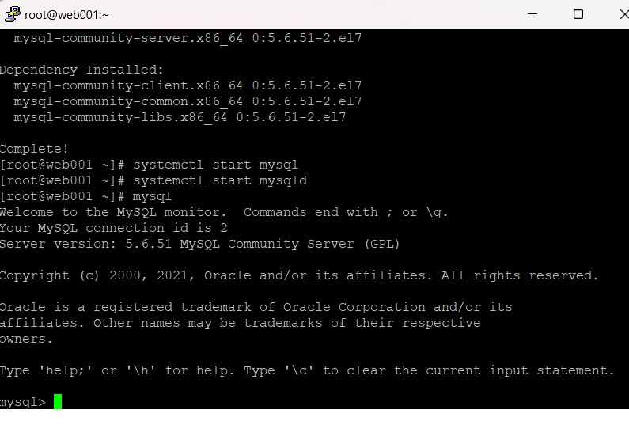

[참고 사이트]

[레퍼런스1](https://docs.mattermost.com/upgrade/upgrading-mattermost-server.html)  mattermost 업그레이드하기   
[블로그참조2](https://dev-syhy.tistory.com/14)  mySQL 설치 시 명령어 참조   
[블로그참조3](https://harsik.github.io/linux/2019/09/16/MySQL.html)  mySQL putty에 설치하기   
[레퍼런스4](https://www.lesstif.com/system-admin/yum-14745755.html) 
[레퍼런스5](https://qjadud22.tistory.com/32) 
[레퍼런스6](https://toma0912.tistory.com/64) 
[레퍼런스7](https://wikidocs.net/16274) MariaDB 설치   
[레퍼런스8](https://dausruddin.com/creating-user-in-mysql-with-mysql_native_password-spitting-syntax-error/) Creating user in MySQL with “mysql_native_password” spitting syntax error
:    ->  결국 [네이버Cloud Mattermost Chat Platform 구축 설명](https://www.ncloud.com/guideCenter/guide/27) 에 나온 한글 그대로 침 
