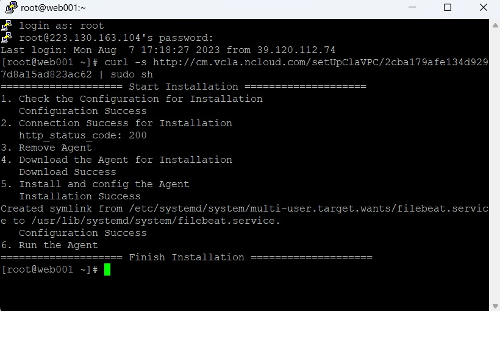

## 17강

Monitoring  
 - 인프라가 얼마만큼 잘 사용하고 있는지, 잘 동작하고 있는지

Sub Account  
 - 보통 대표계정인데, 지원이 많고 각 팀에 대해서 아레나를 하고자 한다면
 - 서브 계정 별 역할 부여를 통한 리소스 관리를 한다.
 - 다수의 사용자가 동일한 자원을 이용하고 관리할 수 있도록 역할을 부여한 서브 계정을 제공하는 서비스(RBAC)  

2차 인증 설정
 - 서브 계정이 작업한 모든 내역은 Cloud Activity Tracer 상품에서 확인 가능  

Web Service Monitoring System
 - 고객의 웹페이지 품질 측정 도구
 - 웹 서비스 URL을 입력하여 실시간으로 테스트를 진행할 수 있고, 스케줄을 등록하여 반복적인 모니터링 수행도 가능
 - 경보 설정을 통해 모니터링 등록된 URL에서 오류가 감지되면 SMS나 EMAIL을 통해 알람 발송 가능
 - 시나리오 기반 모니터링을 제공하여, 사용자 이용 패턴에 따른 각 기능별 모니터링 수행 가능  

## 18강 (Management) Cloud Insight 서비스 신청 및 설정 데모

Notification으로 알람을 받을 수도 있다

## 19강
Data Analytics Service
DAS

ELSA
Effective Log Search & Analytics
- ELSA의 SDK/API를 이용하여 어플리케이션을 쉽게 저장하고 검색, 분석할 수 있는 로그 분석 툴
- 특정 로그 발생시 알람을 보내는 이벤트 기능과 App Crach Report도 제공 예정

CLA
시스템 로그 수집 분석 플랫폼
- Agent 기반으로 동작
- Syslog, Apache Log, MySQL Log, Tomcat Log, Windows Event Log, MS-SQL error Log 수집
- 커스텀 로그 기능을 통해 직접 로그 대상 지정 가능
- Object Storage와 연계되어 로그파일 보관 기능 제공

Cloud Hadoop
빅데이터 분석 도구
- 하둡 클러스터를 보다 쉽고 편리하게 생성 및 관리
- Apache Ambari를 기본 제공하여 하둡 클러스터의 관리 및 모니터링을 효율적

Elasticsearch Service
- Elasticsearch 클러스터를 손쉽게 배포, 보호, 운영 및 확장하여 로그분석, 검색, app 모니터링 등을 수행할 수 있도록 제공하는 완전 관리형 서비스
    - Elasticsearch service 클러스터는 1대의 매니저 노드와 3대 이상의 데이터 노드로 구성(데이터 노드 수는 설치 시 원하는 만큼 증설가능)
    - Elasticsearch service는 데이터 분석 및 시각화 플랫폼인 Kibana와 연계되어 빠르고 정확하게 분석 가능
 
## 20강 (Analytics) Cloud Log Analytics 활용법 데모

CLA 

Agent 설치완료 

## 21강
Site Safer, App Safer

Site Safer
- 고객의 웹페이지에 악성 코드가 있는지 주기적으로 검사
- NCP 외부 IP 대역도 점검 가능
- 행위 기반 탐지

App Safer
- 고객의 APP 실행 모바일 환경에 대한 보안 위협 여부를 실시간으로 탐지
- 치팅 프로그램, 핵 등으로 APP 무결성 검사

Web Security Checker
- 고객의 웹사이트 보안 취약점 진단
- 고객의 웹페이지에 취약점이 없는지 체크
- 현재 18가지 주요 웹 취약점에 대해 점검(원하는 항목만 선택가능)
- 취약점에 대한 진단 뿐만 아니라 대응방안도 함께 제공

Certificate Manager
- SSL 인증서 등록 및 관리의 통합
  - 네이버 클라우드 플랫폼의 연계 상품에서 사용할 인증서를 등록할 수 있으며, 등록 시 인증서 유효성을 체크
  - 인증서의 만료 예정일 한달 전부터 정기적으로 알람 메일과 SMS를 발송

SSL VPN을 통한 서버 접속

## 22강 (Media) 미디어 서비스 소개

Live Station
실시간 방송을 위한 플랫폼
 - 트랜스코딩을 통해 여러 화질로 변환 후, 송출
 - 스트림 상태를 볼 수 있는 모니터링 기능 제공
 - Thumbnail Image 추출
 - 타임머신 기능으로 놓치지 않는 라이브 방송 서비스 구현 가능
 - CDN 연동을 통해 안정적인 송출 가능
