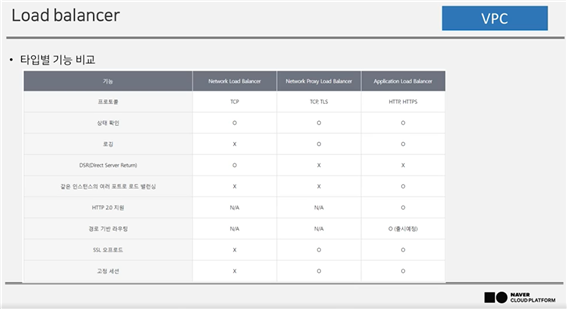

## 7강: 로드 밸런서, CDN 서비스 소개

1. Load balancer
 1) Target Group: 요청을 처리할 대상에 대한 집합
- 동일 VPC내에 있는 서버들에 대해 생성 가능
- 1 targer group > 1 load balancer (단, 한 서버를 여러 개의 target group에 속하게 하는 건 가능)
- L4, L7: 서비스 서버의 프로토콜에 따라 분류됨
- 헬스체크 주기(5~300s) 및 임계값 설정(기본은 Round Robin, 알고리즘/Sticky/ProxyProtocol 설정 변경은 생성 이후에 진행)

 2) Protocol
- TCP		: Network LB
- Proxy_TCP	: Network Proxy LB
- HTTP		: Application LB
- HTTPS	: Application LB

 3) Algorithm
- Round Robin		: 클라이언트 요청 > 서버에 1개씩 분배
- Least Connection	: 클라이언트 요청 > 연결이 제일 적은 서버에 연결
- Source IP Hash	: 클라이언트 요청 > 클라이언트 IP 해시테이블로 매핑 서버에 연결

 4) 종류
 4-1) Network LB	: 고성능의 분산처리 기능
 - ip		: client ip 그대로
 - algoritm	: RR, Hash

 4-1) Network Proxy LB	: Classic 과 유사
 - ip		: client ip 그대로
 - algoritm	: RR, Hash

 4-1) Application LB	: HTTP HTTPS 사용 웹 app에 유연한 구성 가능
 - ip		: 고정 ip 제공
 - algoritm	: RR, LC, Hash

 5) 사용 기능에 따른 LB 분류
- TCP 레벨 고성능 분산처리	: Network LB
- TCP 세션 관리			: Network Proxy LB
- TCP 세션 관리			: Network Proxy LB
- SSL 인증 및 암호화 설정	: Application LB, Network Proxy LB
- 다양한 서버 분산 방식		: Application LB, Network Proxy LB
- L7(Applicatio Leyer) 기능 제공	: Application LB
- LB 모니터링			: Application LB, Network LB 
- LB 포트 설정

2. Global DNS: 도메인 등록 서비스
- 지원 레코드 타입: A, NS, PTR, AAAA, MX, CNAME, SPF, TXT, SRV, CAA
- Alias 기능, 설정 반영 단계 O
- 등록 도메인 인입되는 트래픽을 분기(Round Robin)
- 모니터링 기능 O

3. CDN+, Global CDN: 컨텐츠를 캐싱(caching)하여 사용자에게 전송하는 서비스
- 지역에 따른 서비스 상품 분리	: 국내-CDN, 국외-GCDN
- 원본 보관			: NCP Object Storage, Custom Origin Server 등
- 도메인				: 랜덤 CND 도메인 or 보유 도메인
- 지원 프로토콜			: HTTP/S
- CDN 필요한 경우		: 대규모 트래픽 발생 서비스(대규모 파일 배포, 이미지 서비스, 동영상 서비스 등) 운영시 웹서버보다 효과적

## 9강: IPSEC-VPN, NAT Gateway, GRM 서비스

1. IPSEC VPN: 고객의 사내망 – NCP 간 사설 통신을 위한 IPSEC VPN
- 고객의 VPN 장비, NCP VPN장비 간 터널링 연결 제공(통신방식 호환 필요)
- NCP 서버 통신 대역: Private Subnet 대역 
- BW: 최대 30Mbps

2. NAT Gateway: 비공인 IP를 가진 다수의 서버에 대표 공인 IP를 이용한 외부 접속 제공
- 사용 대표 공인 IP: 해당 NAT Gateawy만 독점적으로 사용하는 IP
- Auto Scailing과 연계된 자동 설정 제공
- 사용 예시: 보안상 다수의 공인 IP에 대한 ACL 오픈할 수 없는 경우, 공인 IP 생성 비용 절감이 필요한 경우

3. Global Route Manager: DNS 기반의 다양한 방법을 통해 네트워크 트래픽을 안정적으로 LB 하는 GSLB상품
- 사용 예시: 지역별 트래픽 기반 부하 분산, DR 구축
- LB 타입: Round Robin, Weighted, GeoLocation, Failover
- 제공: only IP Health Check

## 11강: Storage 서비스

1. Object Storage: 인터넷상에 원하는 데이터를 저장하고 사용도록 구축
- 객체 기반, 무제한 파일 저장
- Object 관리 방법: 콘솔, RESTful API, SDK 등
- 저장된 파일 접근 방식: 각 파일마다 고유 접근 URL 부여
- 정적 웹 사이트 호스팅 (O)
- 특징
1) S3 Compatability API (O)
2) Data Lifecycle (O)
3) Sub Account 연동 접근 제어(O)
4) NCP 내 상품 통합 연계 지원(CDN, Transcoder, Image Optimizer, Cloud Hadoop, Cloud Log Analytics 등)

2. Archive Storage: Archving Data/Infreauent Data 장기 보관
- VS Object Storage: 데이터 저장 비용(down), 데이터 처리 API 비용(up)
- 특징
1) Data 관리 방법: 콘솔 API(swift, s3), CLI, SDK 
2) 데이터 최소 보관 기간(X)
3) Object 생명주기 관리(O)
4) Sub Account 연동을 통한 권한 관리 기능(O) 

3. NAS: 다수의 서버에서 고유하여 사용할 수 있는 스토리지
- 용량: 최소 500GB ~ 10TB(+:100GB)
- 데이터 복구(O)(NAS 가용량 안에서 생성된 스냅샷 이미지 이용)
- 프로토콜: NFS/CIFS
- 타 계정 서버에 마운트하여 사용 가능(서버 사설 IP 이용한 ACL 오픈)
- VS Block Storage: 용량 최소단위 up(단점), 공유 가능(장점)

4. Data Teleporter: 대용량 데이터이전을 위한 전용 어플라이언스 대여
- 용량: 최대 100TB
- 장점: 네트워크 비용 절감, 안전하고 빠른 데이터 이관
- 이관 데이터 보관 장소: NCP Object Storage/NAS

5. Backup: 서버 내 파일 Prienstall DB
- 사용 방법: (ncloud.com > 고객지원 > 자료 > )백업 요청서 작성 > 서버에 Agent 설치
- 백업 주기 옵션: 1회성/1일 1회 전체 백업/1주 1회 전체 백업&매일 증분 백업 등
- 백업 파일 보관 기간: 최대 24주

