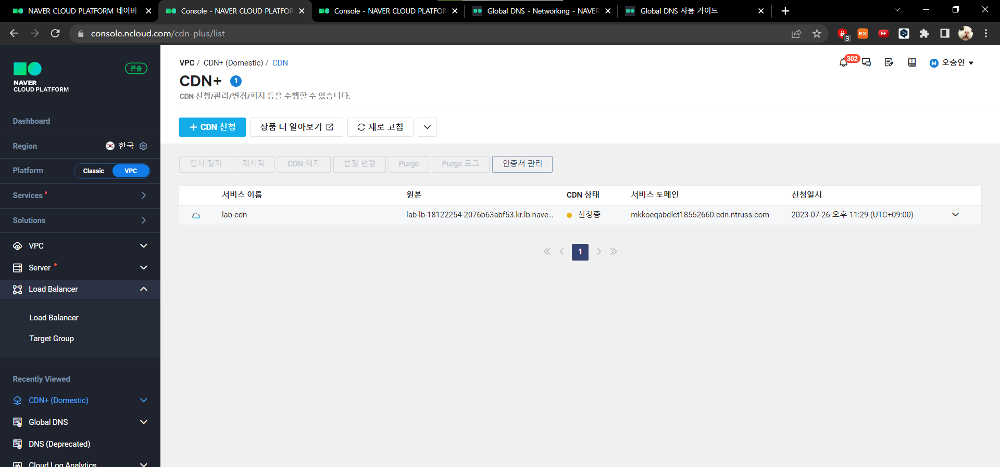
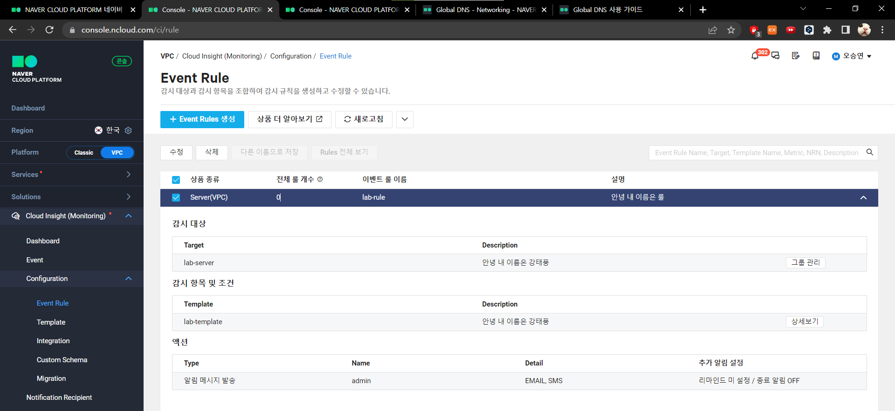

## 8강

로드 밸런서 서비스 생성: assential hands on과 겹침

DNS

미리 도메인 만들어두기
도메인에 레코드 추가해서 호스트 등록

/> 공인 IP가 두개 만들어짐
LB IP 하나, 웹서버에 부여된 IP 하나

웹서버: A레코드 사용
LB: cname레코드 사용

NS look up으로 정상적인 IP가져오는지 확인 가능

CDN

거의 기본 설정으로 설정

ACCESS LOG : 떨구기 위해서는 반드시 오브젝트 스토리지가 먼저 만들어져야함

## 10강

assential hands on과 거의 유사하다고 느낌

팁: 서버가 올라오는 시간+동작 시간을 고려해 헬스체크, 쿨다운 시간 선택(소스를 다 못 받아와서 오류가 생길 수 있음)