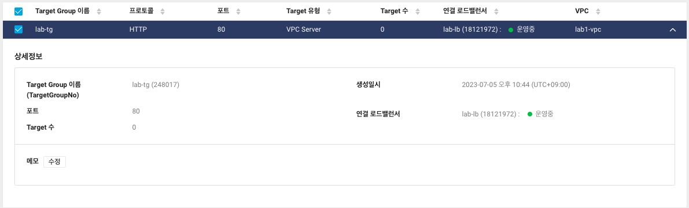
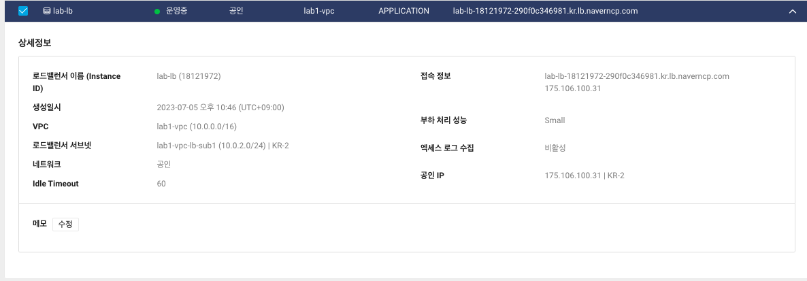
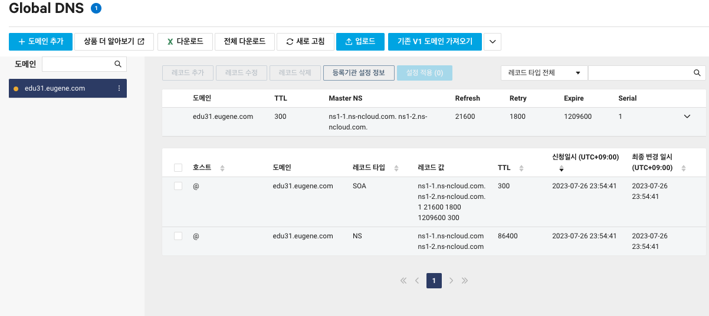
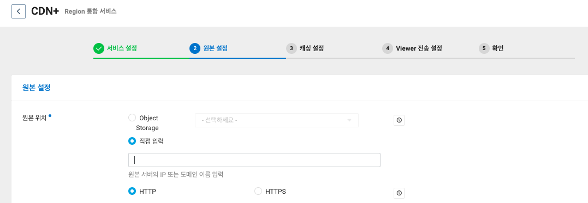
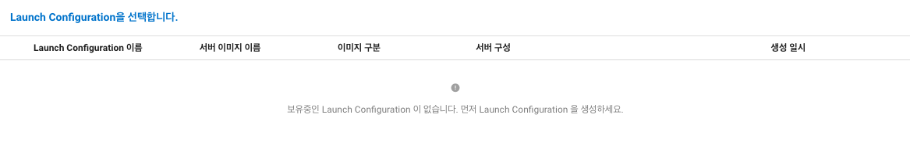
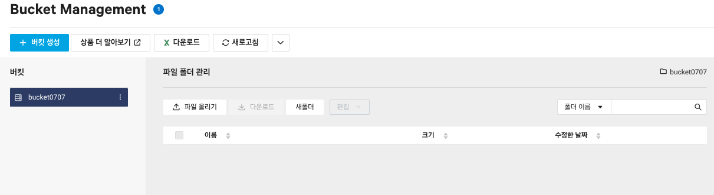

# 7강. 로드밸런서, CDN 서비스 소개

## VPC 환경에서의 로드밸런서
로드밸런서를 구성하기 위해서는 `Target group`을 먼저 만들어 준 이후 로드밸런싱을 처리해야 한다. 타겟 그룹은 동일 VPC 내에 있는 서버들에 대하여 타겟 그룹을 생성할 수 있고, 타겟 그룹 안에 있는 서버를 다른 타겟 그룹에 속하게 할 수 있지만 타겟 그룹을 다수의 로드밸런서에 연결할 수는 없다. 

### NCP의 로드밸런서
부하처리 성능에 따라 small, medium, Large 중 선택할 수 있으며, 알고리즘은 `Round Robin`, `Least Connection`등을 사용하고 있다. 

## 로드밸런서의 타입
- 애플리케이션 로드밸런서 : HTTP, HTTPS를 사용하는 웹 애플리케이션에 유연한 기능을 사용할 수 있고, 고정 IP를 사용한다.
- 네트워크 로드밸런서 : 고성능의 분산처리를 수행할 수 있다. Client IP는 그대로 로깅되어, Client의 실제 IP를 쉽게 관리할 수 있다는 장점이 있다.
- 네트워크 프록시 로드밸런서 : classic과 유사한 proxy 로드밸런서 이용 

### 로드밸런서가 제공하는 기능을 정리해보자.
- TCP 레벨 고성능 분산처리 - 네트워크 로드밸런서
- L7 기능 제공 : 애플리케이션 로드밸런서 
- Load Balancer 모니터링 및 포트 설정 기능을 제공하고 있다.

## Global DNS
- 도메인 등록 서비스 존재
다양한 레코드 타입을 지원하고 있고, Alias 기능 제공 및 설정 반영 단계를 추가할 수 있다. 등록 도메인으로 인입되는 트레픽을 분기하여 (Round Robin 방식 이용) 관리하고 있다.

### CDN+, Global CDN
컨텐츠를 Caching하여 보다 빠르고 안정적으로 사용자에게 전송하는 서비스가 존재한다. 
 - 국내, 국외 주 서비스 지역에 따라서 CDN 상품을 분리하여 제공하고 있다. 원본은 NCP 오브젝트 스토리지 혹은 커스텀 오리진 서버를 둘 수 있따.

=> CDN이 왜 필요한데?
- 대규모 파일 배포, 이미지 서비스, 동영상 서비스 등 트래픽이 발생하는 경우
- 웹서버를 통해 배포하게 되면 웹서버의 용량이 기하급수적으로 늘어나서 이를 관리하기 위해 

# 8강. 로드밸런서 실습
## 1. target 그룹을 만들자

먼저 로드밸런서를 적용할 `Target Group`을 만들어줍니다. health check는 2로 통일시켜 2번의 기회를 주고 2번을 넘어서면 다시 체크할 수 있도록 해 줍니다.

## 2. 로드 밸런서를 생성하자

로드 밸런서를 생성합니다. 도메인과 로드밸런서를 이용하여 global DNS를 만들 수 있다.

## 3. 도메인을 생성하자 (Global DNS)

도메인을 생성하였으므로, 이제 공인 아이피를 연결해 줄 수 있는 레코드를 생성하도록 하자. 공인 아이피를 연결하게 될 것은 `load balancer`의 IP를 연결해주면 되는 것이다. 

이렇게 도메인을 등록한 이후 배포를 하게 된다면 된다.

## 4. CDN 설정

이렇게 로드밸런서를 만들고 이를 이용하여 DNS를 만들고, 서비스를 이용할 수 있도록 DNS 서비스를 구성해 볼 수 있게 되었다.

# 9강. IPSEC-VPN, NAT Gateway, GRM 서비스 소개
나머지 네이버 클라우드 플랫폼의 네트워크 서비스를 알아보자.
## IPSEC-VPN
고객의 사내망과 NCP 간의 사설 통신을 위한 IPSEC VPN이다. 고객의 VPN 장비와 NCP VPN 장비 간의 통신을 원활히 진행할 수 있다.

## NAT Gateway
비공인 IP를 가진 다수의 서버에게 대표 공인 IP를 이용한 외부 접속을 제공한다 (은행이나 통신사에서 자주 쓴다) NAT Gateway를 통해 외부로 접속할 때 사용되는 대표 IP 공인은 NAT Gateway만 독점적으로 사용한다. 

## Global Route Manager
DNS 기반의 다양한 방법을 통하여 네트워크 트래픽을 안정적으로 로드밸런싱 할 수 있는 GSLB 상품이다. 해외 서버로 접속할 수 있도록 Router를 관리하는 서비스라고 생각하면 된다. 로드밸런싱 타입은 총 4가지 제공을 해 준다. 

# 10강. Auto-Scaling 활용법 데모 시연
급격한 트래픽 변경에 대하여 서버를 줄이거나 늘이기 위한 유연한 대처를 위해 존재하는 것이다. 

먼저 `Launch Configuration`을 생성한 뒤에 서버를 몇개 정도 생성할 지 정할 수 있어야 한다. Auto scaling의 범위에 따라서 서버의 수가 유동적으로 움직이기 때문에 이에 대한 상한선 등을 직접 설정해주는 것이 중요하게 작용한다. 

# 11강. Storage 서비스 소개
## Object Storage
인터넷 상에서 원하는 데이터를 저장하고 사용할 수 있도록 구축된 오브젝트 스토리지이다. 객체 기반의 무제한 파일 저장 스트로지가 존재하고, 정적 웹 사이트 호스팅이 가능하다.
### Object Storage 특징
- S3 Compatibility API 지원
- Data LifeCycle 지원
- Sub Account 와의 연동으로 접근 제어가 가능하다
- CDN, Transcoder, Image Optimizer와 같은 NCP 내의 다양한 상품과 통합 하고 연계하여 지원할 수 있다.

## Archive Storage
데이터 아카이빙 및 장기 백업에 최적화된 스토리지 서비스이다. Infrequent Data 백업 및 Archiving Data 보관을 주 목적으로 하는 스토리지이다. Object Storage보다 데이터 저장 비용은 저렴하되, 데이터 처리 API 비용은 비싸다.
### Archive Storage 특징
- 콘솔 API, CLI, SDK를 이용하여 데이터를 관리할 수 있다.
- 데이터 최소 보관 기간 없이 사용할 수 있음

## NAS
다수의 서버에서 공유하여 사용할 수 있는 스토리지이다. 최소 500GB에서 10TB까지 구성이 가능하고, 추가는 100GB 단위로 추가 기능이 존재한다. NAS 가용량 안에서 생성된 스냅샷 이미지를 이용하여 데이터에 대한 복구 기능이 제공된다. 프로토콜은 NFS/CIFS를 제공한다. 

## Data Teleporter
대용량 데이터 이전을 위한 효과적인 솔루션이다. 전용 어플라이언스를 대여하여 네트워크 비용을 절감하고, 빠르게 데이터를 이관할 수 있도록 하는 것이다. 

## Backup
서버 내 파일 및 preinstall DB에 대한 백업을 설정한다. 백업 요청서를 작성하여 신청하고, 서버에 Agent를 설치하면 끝난다! 백업 수행 주기로 8가지의 옵션을 제공하고 있다. 

# 12. Object Storage 및 NAS Storage 생성 및 활용 데모

버킷을 생성하고 S3 파일을 연결해주기 위해 다운로드를 받아 수행합니다.
만약 NAS의 임계치를 넘어가게 되면 알람을 받을 수 있도록 설정해 두어야 한다.