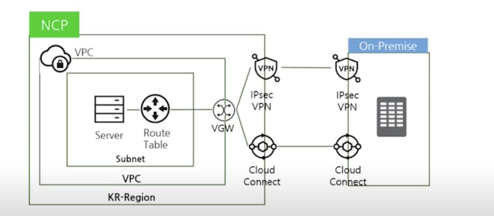
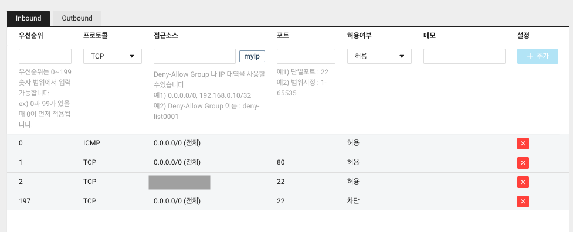
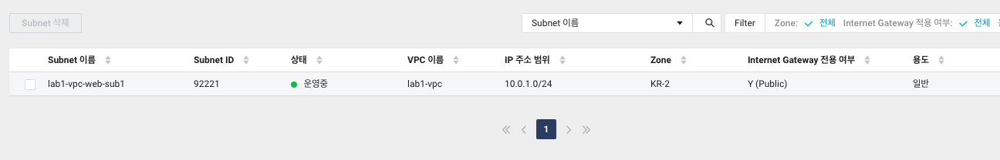
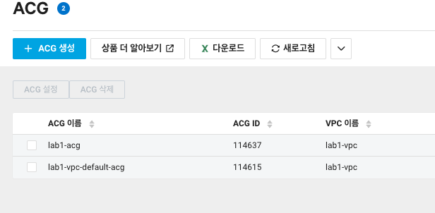
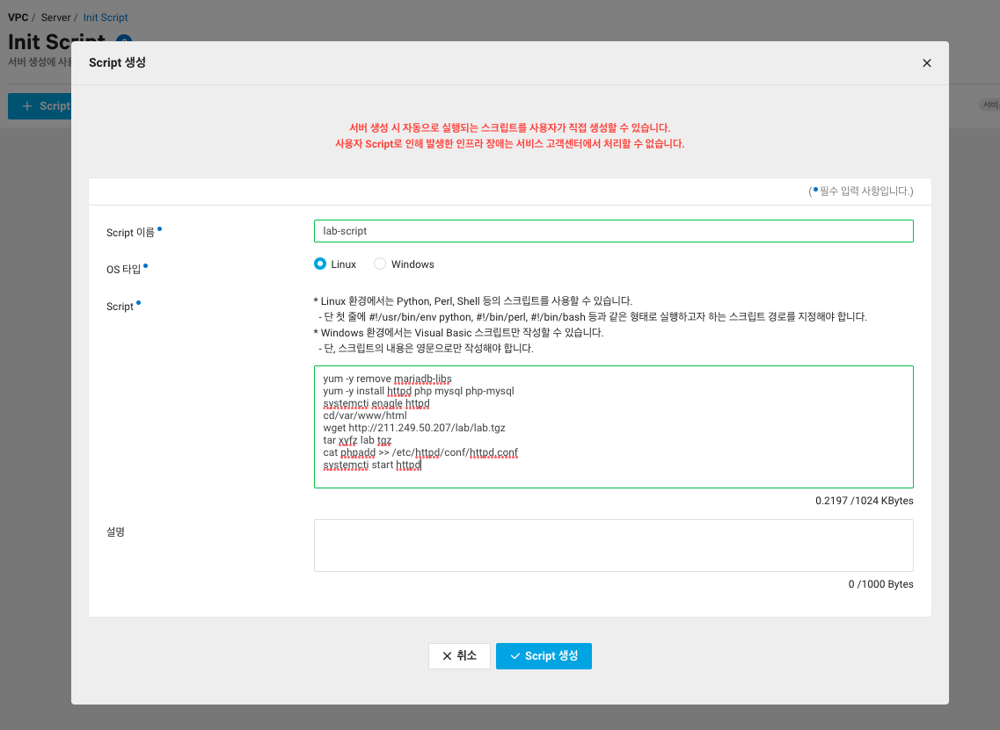
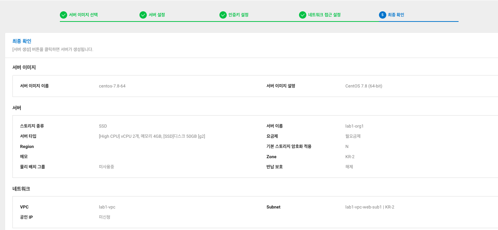
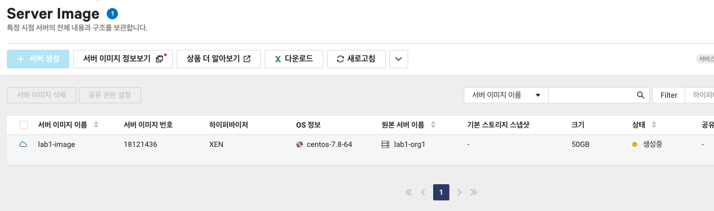
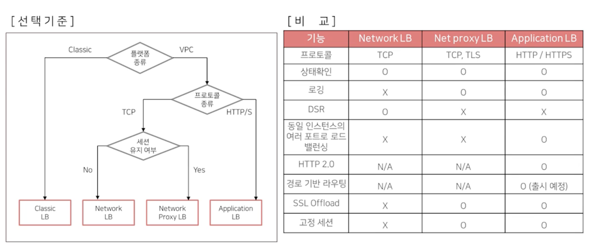
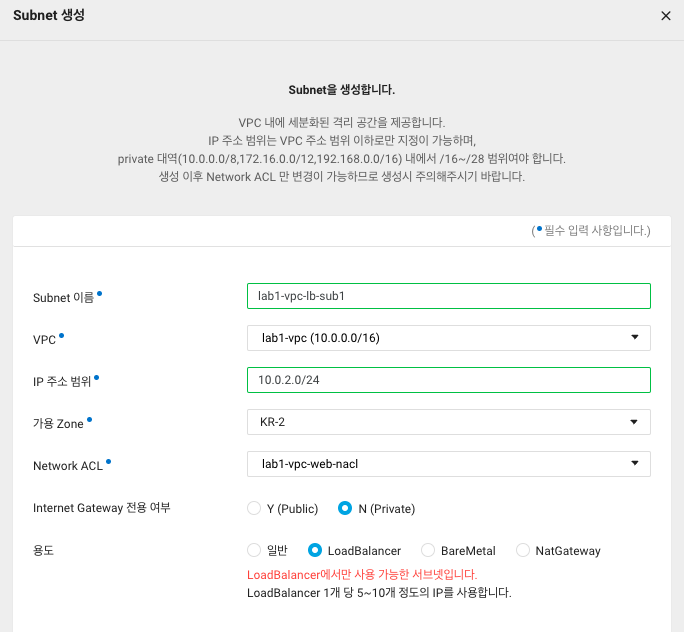
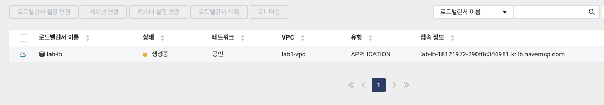

# 1강: 네이버 클라우드 플랫폼 소개 

## 네이버 클라우드 플랫폼의 장점
- 쉬운 사용자 경험을 가지고 있음
- 공공 클라우드와 금융 클라우드를 운영하고 있을 만큼 체계적으로 보안을 위해 관리하고 있다.
- 빠른 상품 출시 및 상품 개선, 사용자 의견을 수용하여 피드백을 적극적으로 반영하고 있다.

```
네이버 클라우드 플랫폼에서는 다양한 인프라를 위한 서비스를 운영 중에 있고, 이후 강의부터 이에 대해 하나하나 살펴보도록 하자
```

# 2강: VPC 서비스와 Compute 서비스 소개

## VPC란 무엇인가?
`Virtual Private Cloud`의 약자로, 가상 사설 클라우드를 구축할 수 있게 해 준다. 퍼블릭 클라우드 상에서 제공되는 고객 전용 사설 네트워크이고 논리적으로 분리된 네트워크를 운영할 수 있게 한다.

사설 IP 주소를 제공하고 있으며, 네트워크 트래픽도 `Subnet` 단위로 제어할 수 있도록 기능을 제공할 수 있다.

## Subnet/NACL
### Subnet이란?
VPC 네트워크 대역 공간을 세분화하여 이용할 수 있으며, 인터넷 게이트웨이, NAT 게이트웨이용 서브넷을 별도로 생성하여 외부 인터넷과의 통신을 조절할 수 있다.

### NACL이란?
Subnet과 연결하여 보안을 강화하기 위하여 사용하는 도구이다. VPC의 보안을 강화시킬 수 있는 기능을 가지고 있다. Subnet 단위로 작동하면서, `Stateless`하여 Response 규칙에 따라 Allow 규칙이 추가적으로 필요하다.

### Virtual Private Gateway
VPC와 VPN, IPsec 또는 Cloud Connet를 연결해주는 접점이다. 


# 3강: Compute Operation 소개
## 다양한 이미지 알아보기
### 서버 이미지
만든 서버를 이미지로 만들 때를 이야기 하는 것을 이미지라고 한다. 서버의 OS와 추가적인 볼륨들을 담을 수 있으며, 이미지를 만든다고 해서 서버를 종료할 필요는 없다. 이미지를 생성할 때 원하는 디스크 타입을 설정할 수 있고, 한국 리전에서만 이용하는 것 뿐만 아니라 리전 간 이미지 공유를 통하여 지역도 자유롭게 설정 가능하다.

### 스냅샷
서버 이미지와 다양한 부분에 대하여 공통점을 가지고 있지만, 서버 OS를 포함할 수 없고, 디스크 타입이나 디스크의 사이즈는 변경할 수 없다. 

```
서버 이미지는 `Server image builder` 라는 패커를 통하여 이미지를 쉽게 생성할 수 있다.
```

## Init Script
서버 생성 시에 실행되는 스크립트를 지정할 수 있다. 패키지나 초기 설정 내용을 하나의 스크립트로 정리하여 공통적으로 초기 세팅할 때 필요한 스크립트를 따로 빼서 관리할 수 있다는 것이다.

## ACG, Anti-Virus

### ACG (Access Control Group)
서버 방화벽 역할, 룰 설정 가능. 프로토콜은 TCP, UDP, ICMP 중 선택하여 설정할 수 있다. Inbound/OutBound의 룰을 설정할 수 있다.

### Anti-Virus
Window를 사용할 경우 무료로 바이러스 대응을 할 수 있으나, Linux를 사용할 경우 추가 비용이 발생한다.

## Autoscaling
유연하게 인프라를 확장하거나 축소할 수 있게 하는 기능이며, 네이버 클라우드에서는 아래 기능을 활용할 수 있다.
### 1. Lanch Configuration
- 한 계정 내에 유일하게 관리할 수 있음
- 액션의 대상이 되는 서버의 기본 템플릿이 존재함.
- 베이스 이미지는 퍼블릭 이미지, 커스텀 이미지를 사용할 수 있음

### 2. Autoscaling Server Group
- Scaling, Management 액션을 위한 논리적인 그룹

### 3. Event Rule
- 액션의 기준이 되는 모니터링 매트릭을 설정할 수 있음

## Kubernetes Service
완전 관리형 쿠버네티스 서비스를 제공하고 있음

# 4강: 네이버 클라우드 플랫폼에서 서버 생성해보기 (실습)
## 1. VPC를 생성하고, VPC에 대한 인/아웃바운드 룰을 만들어줍니다.

인바운드 설정

아웃바운드 설정

## 2. VPC에 대한 Subnet을 설정하고 접근 권한에 대한 포트 설정을 합니다.


## 3. 서버의 보안을 위하여 ACG를 설정해줍니다.
이도 마찬가지로 Inbound, OutBounda 설정을 해줍니다.


## 4. 모든 세팅이 서버가 실행될 때 자동적으로 이루어지도록 Init script를 세팅합니다.


## 5. 서버를 생성합니다.


서버가 생성되고 나서 사설 IP로는 접근할 수 없다. 외부에서 접근할 수 있는 공인 IP를 만들어주자. 공인 IP를 만들고 나서 Putty와 같은 툴을 이용하여, 서버에 쉽게 접속할 수 있다. 

## 6. 서버 이미지 생성하기

이렇게 서버 중단하지 않고, 서버 이미지를 가져와서 서버를 새로 생성할 수 있고 다른 곳에서 서버를 똑같은 환경으로 복사하듯이 만들어낼 수 있다. 
Init script도 또다시 설정할 필요는 없다. 

네이버 클라우드 플랫폼을 이용하여 서버를 매우 쉽게 만들 수 있음을 깨달을 수 있었다!

# 5강: Network 서비스 소개
네트워크를 논리적으로 관리하기 위하여 `DNS`, `CND` 서비스를 제공한다.
## Load Balancer
부하 분산을 위하여 서버 앞단에서 같은 도메인으로 보이는 것을 트래픽을 분산할 수 있음. 기본적으로 로드밸런서 하나를 생성하면, 뒷단에 서버 2개가 생성되고, 도메인에 바인딩 되어 제공된다. 
### 종류
- 애플리케이션 로드밸런서
- 네트워크 로드밸런서
- 네트워크 프록시 로드밸런서


### 연결 방식
- `Proxy` 방식 및 `DSR` 방식을 모두 지원함
- 알고리즘
    - Round Robin : 클라이언트에서 요청이 오면 서버에 1개씩 분배하는 방식
    - Least Connection : 클라이언트에서 연결이 제일 적은 서버에게 새로운 커넥션을 분배하는 방식
    - Source IP Hash : 클라이언트 IP에 대한 해시테이블을 가지고 클라이언트 IP에 매핑되는 서버에 새로운 커넥션을 분배하는 방식

## DNS 서비스
Round Robin 방식을 이용하여 DNS 관리중. 따로 판매하지는 않음
### 도메인 등록 서비스
- 다양한 레코드 타입을 지원한다.
- 등록 도메인으로 인입되는 트래픽을 분기함 

## CDN 서비스
컨텐츠를 캐싱해서 빠르고 안정적으로 사용자에게 데이터를 전송한다. 국내, 국외 주 서비스 지역에 따라 CDN 상품을 분리하여 제공한다. 원본 서버가 아닌 근처 캐시 서버를 활용하기 때문에 매우 빠르고 원활하게 데이터를 활용할 수 있다는 것이 장점이다.

## IPSEC VPN
고객의 사내망과 NCP 간의 사설 통신을 위해서 생성하는 것이다. 고객이 직접 사설망을 생성해야 활용할 수 있다. 

## NAT Gateway
비공인 IP를 가진 다수의 서버에게 대표 공인 IP를 이용한 외부 접속을 제공하는 것이다.

## Global Route Manager
DNS 기반의 다양한 방법을 통하여 네트워크 트래픽을 안정적으로 로드밸런싱함. DNS 기반으로 하며, 트래픽 부하를 분산할 수 있는 서비스이다.

# 6: 로드밸런서 생성 및 Auto scaling 서비스 구성 (실습)
## 1. 로드밸런서 전용 서브넷 생성

주의해야 할 점은 인터넷을 사용하지 않기 때문에 `Private`로 세팅해주고, 용도는 `로드밸런서` 전용으로 세팅해준다.

## 2. 로드밸런서 생성

타겟 그룹을 생성한 이후 로드밸런서를 생성합니다. 
생된 결과는 `접속 정보`를 통하여 확인 가능합니다.