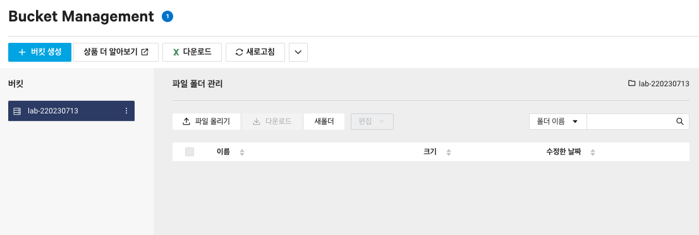
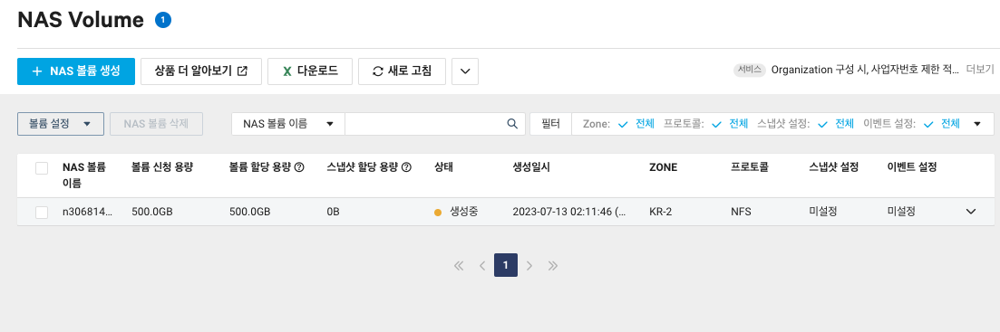
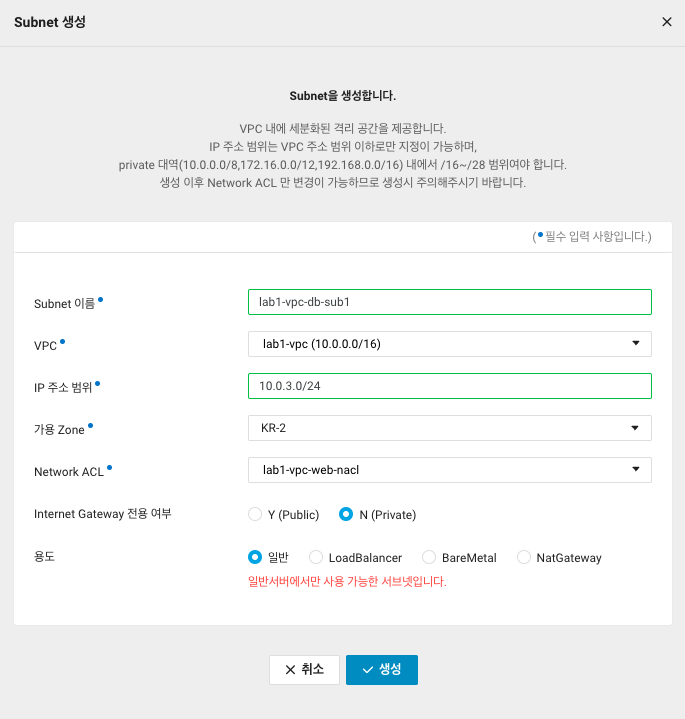
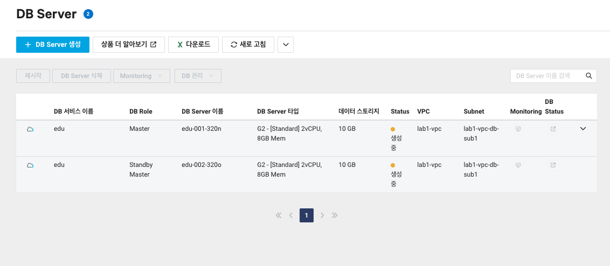
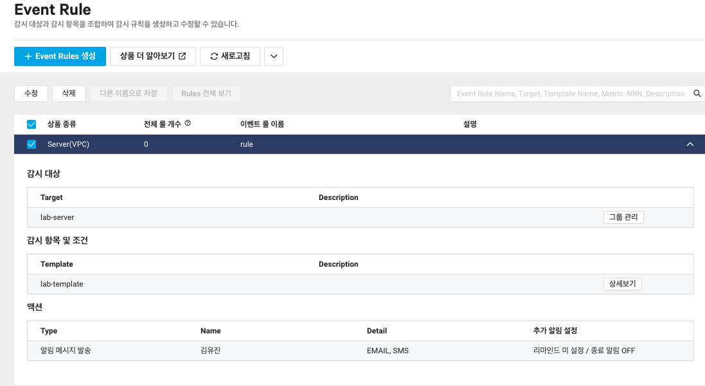

# 7강: Storage 서비스 소개
cloud상에서 데이터를 안전하게 관리할 수 있게 해 주는 서비스이다. 
## Object Storage
사용자가 인터넷 상에 원하는 데이터를 저장하고 활용할 수 있다. 또한 무제한에 가까운 확장성을 가지고 있다. (콘솔, RESTful API, SDK 툴을 이용하여 오브젝트를 관리할 수 있음) 마지막으로 정적인 웹 사이트를 호스팅할 수 있어 웹서버 개발에도 도움이 된다.

### 특징
- S3 Compatibility API 지원하여, 즉 서드파티에서도 손쉽게 이용할 수 있어 유용하다.
- Data Lifecylce 지원
- 네이버 클라우드 플랫폼의 다양한 기능들에도 연결하여 사용할 수 있다. (CDN, VOD Transcoder와 같은 서비스와 통합 연계 지원을 제공하고 있음)
    - 용량이 큰 오브젝트도 쉽게 관리할 수 있음
- 데이터 아카이빙 및 장기 백업에 최적화된 스토리지 서비스를 제공한다.
    - AWS glacier에 대응되는 제품이다.
    - Object Storage보다 데이터를 저장하는 비용은 저렴하나, 데이터를 처리하는 API 비용은 비싸다
- Archive Storage
    - 오브젝트 스토리지에 있는 내용을 자동으로 Archive에 옮겨 관리할 수 있다.
## NAS
NAS는 다수의 서버에서 공유하여 사용할 수 있는 공용 스토리지이다. (최소 500GB, 최대 10TB까지 구성 가능). 가용량 안에서 스냅샷 이미지를 이용하여 데이터가 손실되더라도 쉽게 복구할 수 있다. 프로토콜은 `NFS/CIFS`를 이용하여 제공한다. 타 계정에서 이를 공유하고 시다면 서버 사설 IP를 이용하여 ACL 오픈을 해 주어야 한다.

## Data Telepoter
대용량 데이터를 이전하기위해 이 기능을 이용할 수 있다. 최대 100T까지의 대용량 데이터를 위한 전용 어플라이언스 대여 서비스이다. 네트워크 비용을 절감하고, 안전하고 빠른 데이터 이관이 가능한 서비스이다.

## Backup
콘솔 상에는 존재하지는 않지만, 서면으로 서비스를 신청하게 되면 서버를 백업할 수 있다.  `백업 요청서`를 신청하여 작성하고, 서버에 `Agent`를 설치하면 제공하는 백업 서비스를 이용할 수 있다. 백업 수행 주기는 총 8가지이다. 최대 24주까지 보관을 할 수 있다.

# 8강 : 오브젝트 스토리지 활용안
## Object 스토리지 만들기


네이버 클라우드플랫폼의 서비스에 존재하는 버킷을 직접 생성해보자. 생성된 버킷에 자유롭게 storage 파일을 업로드하여 저장공간을 관리할 수 있다.
S3 브라우저와 같은 서드파티 툴을 이용하여 NCP 내에서 만든 버킷을 연결하여 폴더를 그곳에서 따로 관리할 수 있다. 매우 편리하다.

## NAS 생성하기 

여러 대의 서버가 접속할 수 있는 `NAS Volume`을 생성하였다. 그리고 서버가 이를 이용할 수 있도록 마운트해보자. 리눅스를 실행하여 컴퓨터에서 돌아가고 잇는 서버에 접속해 마운트하는 과정을 진행하자. 
```
mount -t nfs [마운트 포인트 정보] 
```
입력하여 최종적으로 마운트를 마무리하고, 마운트 포인트 정보를 복사하여 뒤에 붙여넣으면 된다. `마운트 포인트`는 만든 NAS 스토리지의 정보 창에 존재한다.

# 9강: 데이터베이스 소개
네이버 클라우드 플랫폼에서는 데이터 베이스를 두가지의 형식으로 제공하고 있다. 이번 강의를 통해서 배울 수 있는 것은 `완전관리형 데이터베이스`이다.
> 완전관리형 데이터베이스 서버는 무엇인가?
자동백업, 자동페이로드와 같은 설정을 데이터베이스 서버를 만들 때 손쉽게 만들 수 있도록 미리 제공하는 서비스이다.

## Cloud DB For MySQL
자동 Fail-Over를 지원하고, 사용자 환경에 맞게 구성할 수 있다. 이는 최대 5대까지 복제할 수 있으며, 확장이 가능하다. (Readonly만 지원) 최대 32vCPU에 256GB의 메모리를 지원하고, 6TB까지 자동 디스크를 확장할 수 잇따. 자동 백업 주기를 설정할 수 있고, 최대 30일까지 백업 파일을 보관하고 있다. `Private Load Balancer`를 사용하면 부하를 분산할 수 있다는 장점이 있다.
### 부가기능 
1. **Master DB Failover**

    콘솔에서 Failover를 수동으로 진행하여 서비스 진행 전 테스트를 진행할 수 있다. 
2. DB Process 모니터링

    DB Server를 연결하여, 수행 중인 Query가 무엇인지 확인할 수 있다.
3. Stand Alone 서버 생성

    단일 서버 생성을 하여, 데이터가 삭제되어도 백업 보관일 설정 내에서 1분 단위로 데이터를 복원할 수 있다. 

4. Multi zone 구성 제공

    액티브 마스터 DB와 스탠바이 마스터 DB를 다른 Zone에 생성하여 Zone 장애 발생 시에 데이터베이스 가용성을 유지할 수 있다.

5. 로그 로테이션 기능 개선

## Cloud DB for Redis
자동 복구를 통하여 안정적으로 운영되는 완전 관리형 클라우드 인메모리 캐시 서비스를 제공한다. 자동 Fail-Over 기능을 독자적으로 개발하여 안정적으로 서비스를 운영할 수 있다. (모니터링 기능도 제공)
VPC 환경 하에서 Redis Cluster를 지원하여, 여러 Redius 노드에서 자동적으로 지원해주고 있다.

## Cloud DB for MS-SQL
MySQL과 굉장히 유사하다. 안정적인 서비스를 제공하기 위하여 자동 Fail-Over 기능을 제공하여, Principal DB와 Mirror DB를 운영하도록 하며, 모니터링 기능 제공을 통하여 에러에 바로 대응할 수 있도록 한다.

# 10강: 데이터베이스 생성 및 연결
먼저 데이터베이스를 생성하기 전 `private VPC`를 생성하여 주어야 하므로 subnet을 만들어 준다.



이제 서버를 만들어보자. 고가용성을 지원하여 안전한 DB운영을 하기 위해 두개의 데이터베이스가 만들어진 것을 확인할 수 있다.


이 때 ACG를 세팅하여 서버에 대한 접속 환경 설정을 세팅할 수 있다. 외부/내부에 따라서 도메인에 대하여 세팅해야 하는 것이 달라질 수 있으므로 이를 꼼꼼히 살펴 설정할 수 있어야 한다. 

# 11강: Management 서비스 소개 
네이버 클라우드 플랫폼 상에서 인프라를 관리하기 편한 서비스들의 모임이다.
## Monitoring 서비스 
클라우드 리소스 상태에 대해서 모니터링을 수행한다. 모든 상품에 대해서 기본적으로 모니터링 서비스가 존재한다. 각 상품 별 통합화된 모니터링 그래프와 대시보드를 확인할 수 있다.

## Cloud Insight
통합 관리 모니터링 서비스이다. NCP의 상품 및 사용자 애플리케이션 성능/운영 지표를 확인할 수 있다. 그리고 단계 별 Event Rule 생성과 그 담당자를 쉽게 확인할 수 있다. 그리고 Event가 발생하였을 때 담당자에게 바로 메일과 SMS가 전송되어 빠른 대처를 할 수 있다. Custom Metric도 설정할 수 있다.

## Sub Account
서브 계정 별로 역할 부여를 통해서 리소스를 효율적으로 관리할 수 있다. 다수의 사용자가 동일한 자원을 이용하고 관리할 수 있도록 역할을 부여한 서브 계정을 제공하는 서비스이다. 2차 인증을 할 수 있고, 서브 계정이 작업한 내용은 모두 `Cloud Activitiy Tracer` 상품에서 확인할 수 있다.

## Web service Monitory System(WMS)
고객의 웹 서비스 품질 측정 도구이다. 웹 서비스 URL 을 입력하여, 실시간으로 테스트를 진행할 수 있고, 스케쥴을 등록하여 반복적인 모니터링을 수행할 수 있다.
경보 설정을 통하여 모니터링에 등록된 URL에서 오류가 나면 SMS와 E-mail이 전송된다.

## Cloud Activity Tracer
다양한 계정에 대한 활동 로그를 기록한다. 약 155종류의 액션 로그를 수집하고, 다양한 서비스에 대한 로깅 기능이 지원된다.

## Resource Manager
NCP 내 서비스의 리소스를 모두 통합하여 볼 수 있는 매니저이다. 목적에 따라 자원들을 그룹화하거나, 태그를 지정하여 다양하게 활용할 수 있다. 

# 12강: 상세모니터링 설정 


모니터링을 진행할 이벤트 룰을 생성할 수 있다. 이번에는 메모리를 80% 이상 사용하면 나에게 알람이 오도록 설정해 두었다.  
꼭 데이터베이스와 서버에 대한 모니터링뿐만 아니라 클라우드에 대한 모니터링도 진행할 수 있고 그에 대한 서비스가 존재한다.

# 13강: Glboal 및 Security 서비스 소개
## Global Latency Status
네이버 클라우드 플랫폼 리전간 전용선 응답시간을 실시간으로 주고받아 `latency`를 체크할 수 있다.

## Site Safer, App Safer를 통한 Security 관리
### Site Safer 
- 고객의 웹 페이지에 악성 코드가 있는지 주기적으로 검사함
- NCP 외부의 IP 대역도 점검이 가능하다.
- 행위를 기반으로 탐지한다.

### App Safer
- 고객의 App 실행에 관련하여 보안상 위험한 부분이 없는지 확인한다.

## File Safer
업로드/다운로드가 되는 파일의 악성코드 여부를 탐지한다. 고객의 웹페이지에 업/다운되는 파일을 감시한다

## Web Security Checker
고객의 웹 사이트 보안 취약점을 진단해준다. 18가지에 대한 점검이 존재하고, 대응방안도 함께 제공해준다. 리포트 형태로 제공하고 있다. `KISA`의 보안 설정 가이드와 `NAVER`의 보안 정책에 따라서 체크한다. 

## Certificate Manager
SSL 인증서 등록 및 관리의 통합이 이루어져 있다.