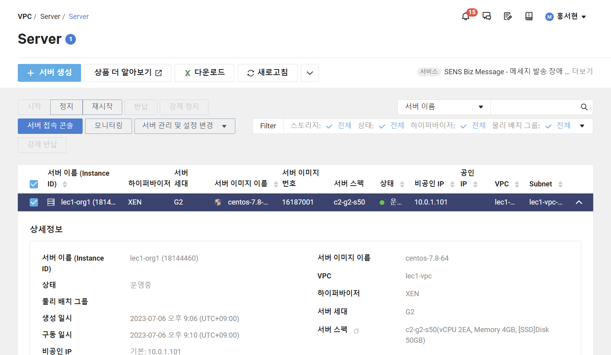
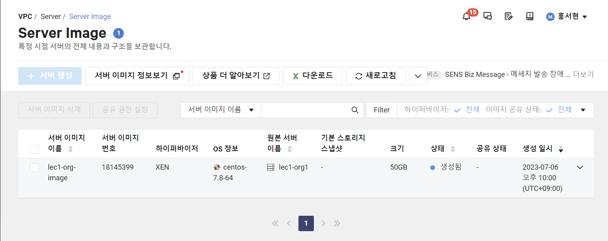
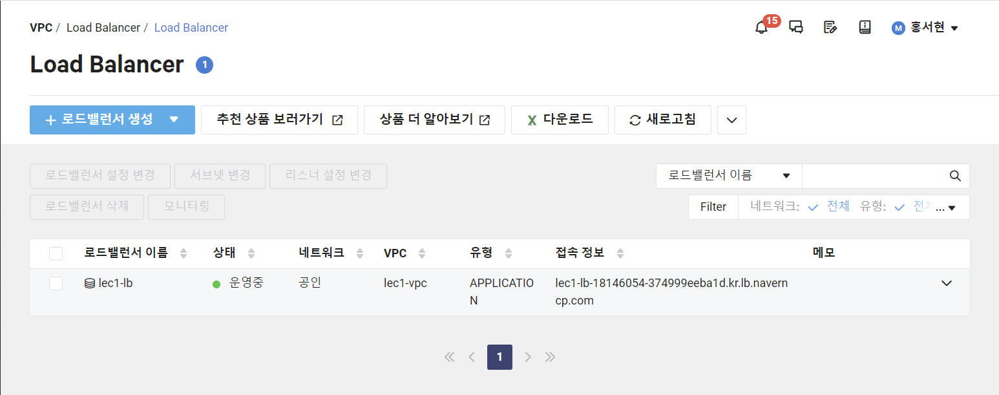

### 클라우드를 도입해야하는 이유

- 비용 절감
    - 데브옵스를 통한 인건비 절감
    - 스케일링 기법들을 통한 인프라 비용 최적화
    - Saas, PaaS, 다양한 부가 상품 활용을 통한 개발 비용 절감
- 빠른 배포 및 글로벌 시장 진출 용이
    - 기존 레거시 인프라에 비해 빠른 배포
    - global 리전을 활용한 손쉬운 글로벌 서비스 가능
- 보안
    - 인프라에 대한 보안은 CSP(Cloud Service Provider)에 위임
    - 서비스 레벨(OS 레벨 이상)에 대한 보안만 신경 쓰면 됨

### VPC(Virtual Private Cloud)

- 퍼블릭 클라우드 상에서 제공되는 고객 전용 사설 네트워크
- 각각의 VPC는 논리적으로 완벽하게 분리되어 있어 다른 사용자의 네트워크와 상호 간섭이 발생하는 영역 없이 사용 가능
- Subnet을 이용해 VPC 내 네트워크 공간을 세분화해서 사용
- NACL(Network Access Contol List)을 이용해서 inbound/outbound 네트워크 트래픽을 Subnet 단위로 제어 가능
- VPC Flowlog 기능을 통해 네트워크 트래픽 정보를 수집, Object Storage에 저장
- VPC 구성 요소
    - VPC, Subnet, Nat Gateway, Route Table, ACG, NACL, Virtual Private Gateway, VPC Peering

### Subnet

- VPC 네트워크 대역 공간을 세분화해서 사용
- 인터넷 게이트웨이(퍼블릭 서브넷), NAT 게이트웨이용 서브넷(프라이빗 서브넷)을 별도로 생성해서 외부 인터넷과의 통신을 조절할 수 있음
- NACL을 이용해서 inbound/outbound 네트워크 트래픽을 Subnet 단위로 제어 가능

### NACL

- Network Access Control List의 약자로 VPC의 보안을 강화시키는 요소
- Allow/Deny 모두 설정 가능, 상태 비저장 방식
- ACG vs NACL
    
    
    | ACG | Network ACL |
    | --- | --- |
    | 서버 NIC 단위로 적용 | Subnet 단위로 적용 |
    | Allow 규칙에 한하여 지원 | Allow, Deny 규칙 모두 지원 |
    | Stateful: Response 트래픽 자동 허용 | Stateless: Response 트래픽에 대한 Allow 규칙이 추가적으로 필요 |
    | 모든 규칙을 확인하여 판단 | 우선순위에 따라 규칙을 반영 |

### Virtual Private Gateway

- VPC와 IPsec VPN 또는 Cloud Connect를 연결하기 위한 접점
- 보안이 확보된 통신 경로를 통해 네이버 클라우드 플랫폼과 온프레미스 네트워크를 잇는 하이브리드 클라우드를 구축

### Route Table

- 외부 연계 네트워크 및 내부 사설 통신 간 흐름 제어

### 서버 생성

1. VPC 생성
2. Network ACL 생성, 설정
3. ACG 생성, 설정
4. Init Script 생성
5. 서버 생성
    
    
    
6. 공인 IP 생성
7. 서버 접근
8. 서버 이미지 생성
    
    
    
9. 서버 이미지로 서버 생성

### Load Balancer

- 부하 분산을 위해 서버 앞 단에서 트래픽을 분산
- 기본적으로 로드밸런서 하나를 생성하면 뒷 단에 Load Balancer 서버 2개가 생성되고 도메인에 바인딩되어 제공
- 종류: 애플리케이션 로드밸런서, 네트워크 로드밸런서, 네트워크 프록시 로드밸런서
- 알고리즘
    - Round Robin: 클라이언트에서 요청이 오면 서버에 1개씩 분배하는 방식 (일반적으로 가장 많이 사용하는 방식)
    - Least Connection: 클라이언트 연결이 제일 적은 서버에게 새로운 커넥션을 분배하는 방식
    - Source IP Hash: 클라이언트 IP에 대한 해시테이블을 가지고 클라이언트 IP에 매핑되는 서버에 새로운 커넥션을 분배하는 방식

### Load Balancer 생성

1. Subnet 생성
2. Load Balancer Target Group 생성
3. Load Balancer 생성
    
    