# Linux 서버 생성

## **서버 생성**

### **STEP 1. 서버 이미지 선택**
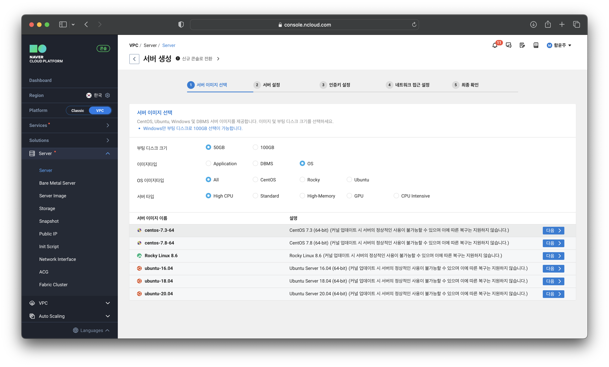

### **STEP 2. 서버 설정**
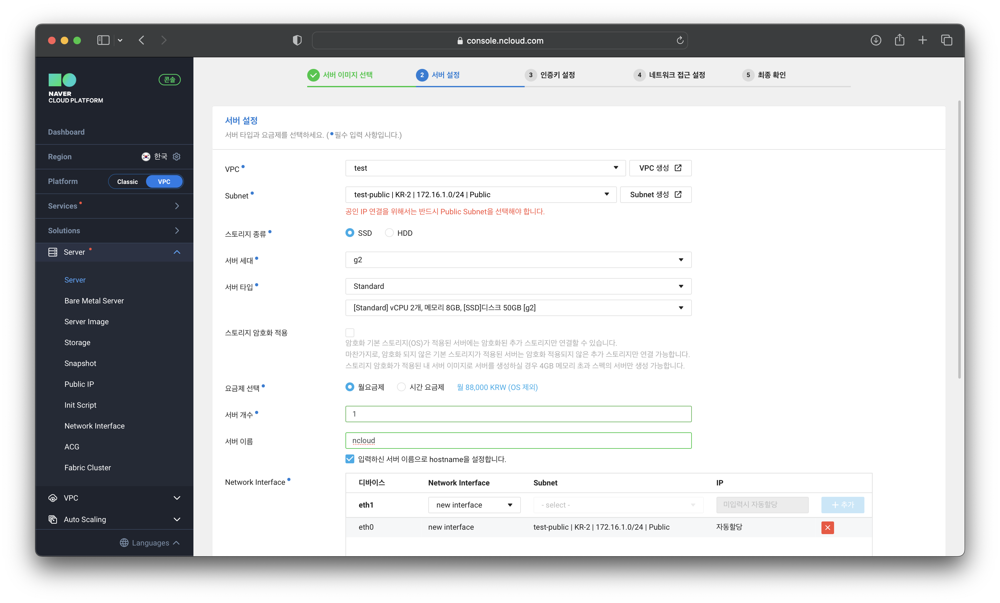

### **STEP 3. 인증키 설정**
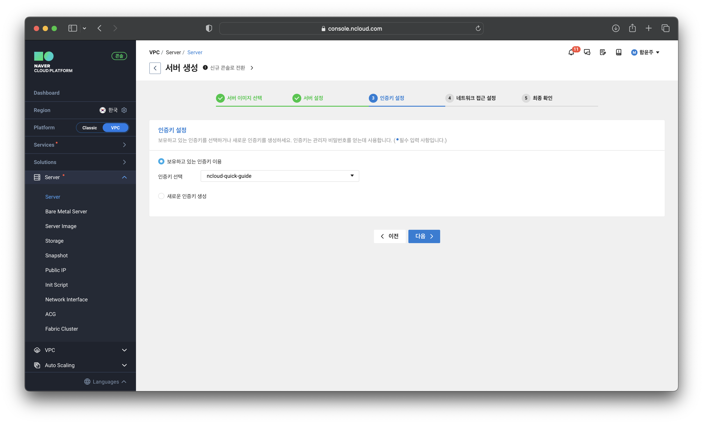

### **STEP 4. 네트워크 접근 설정**
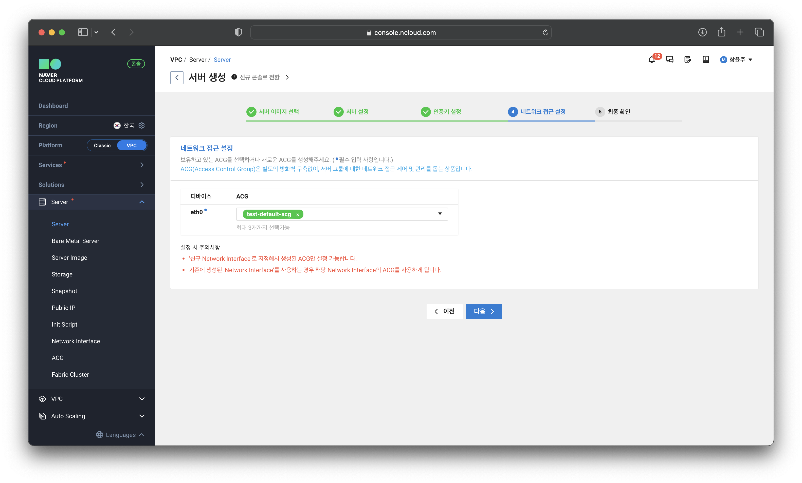

### ****STEP 5. 최종 확인****
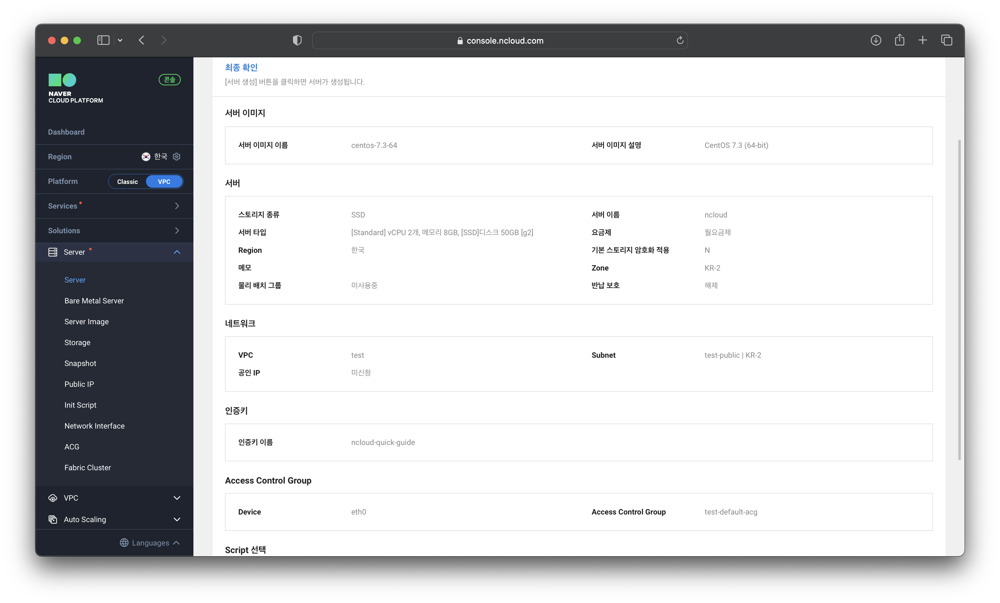

## **서버 접속 환경 설정**

### **STEP 1. 공인 IP 신청 및 할당**
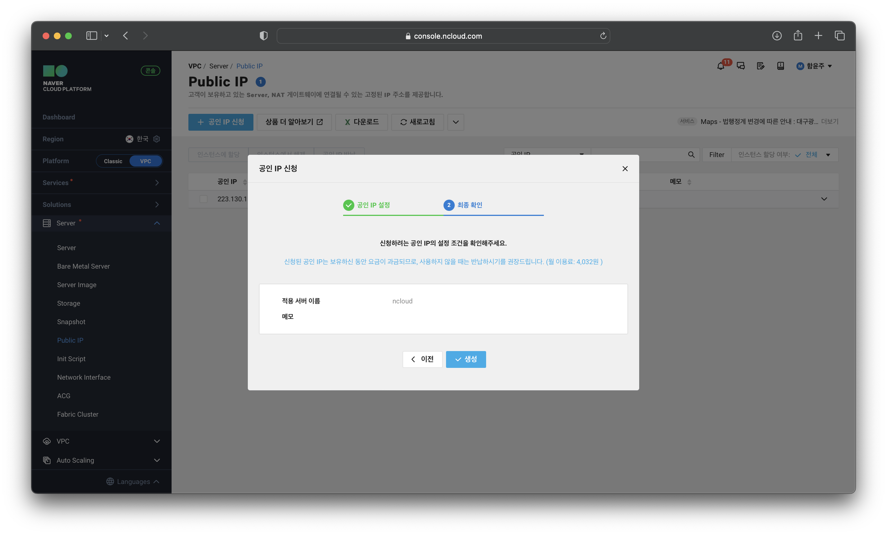

### **STEP 2. ACG 설정**
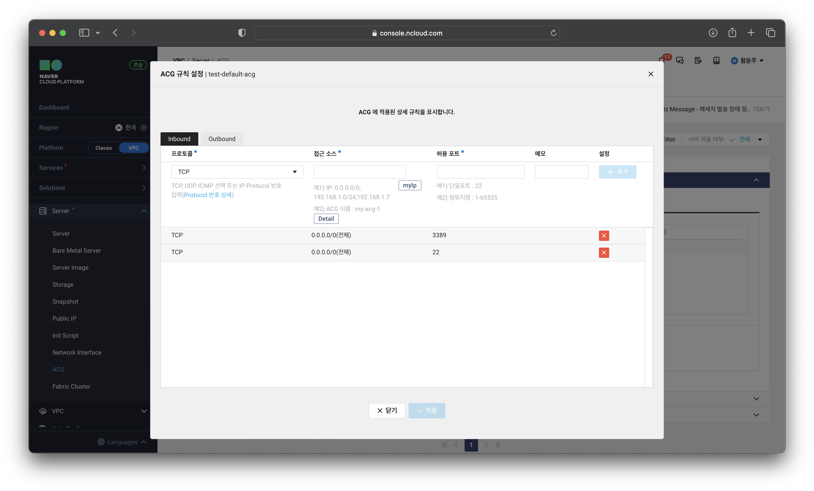

### **STEP 3. 관리자 비밀번호 확인**
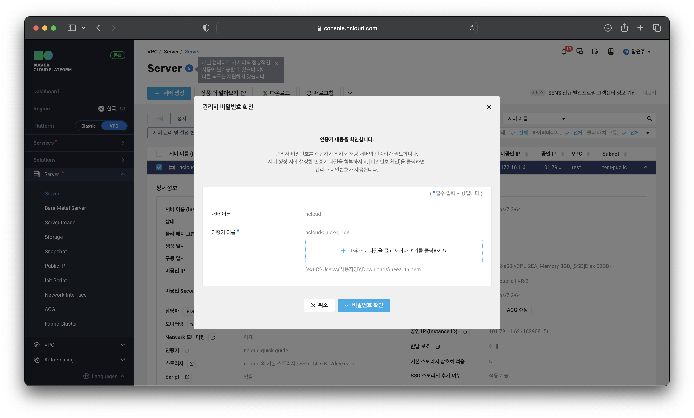

## **서버 접속** (**Mac/Linux)**

## **STEP 1. 터미널 접속**
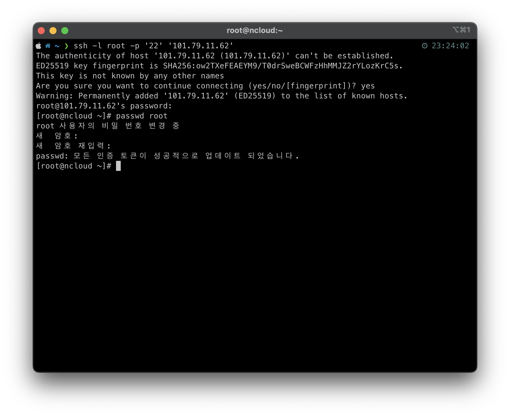

## **서버 정지 및 반납**

### **STEP 1. 서버 정지**
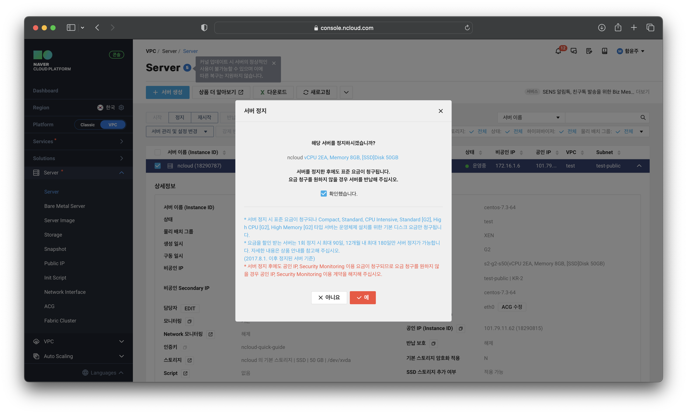

### **STEP 2. 서버 반납**
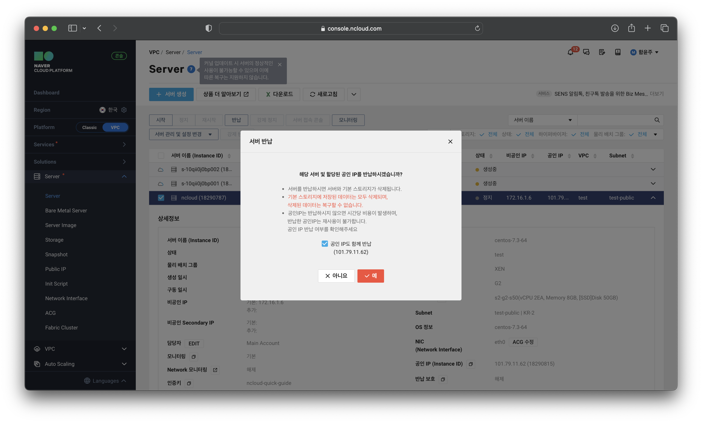