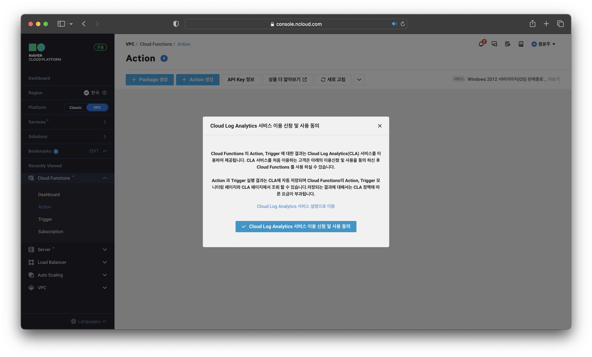
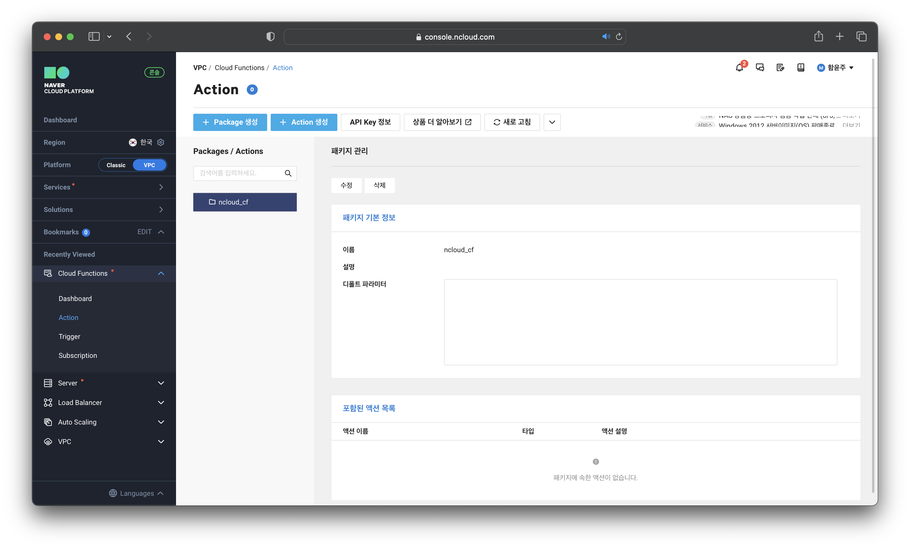
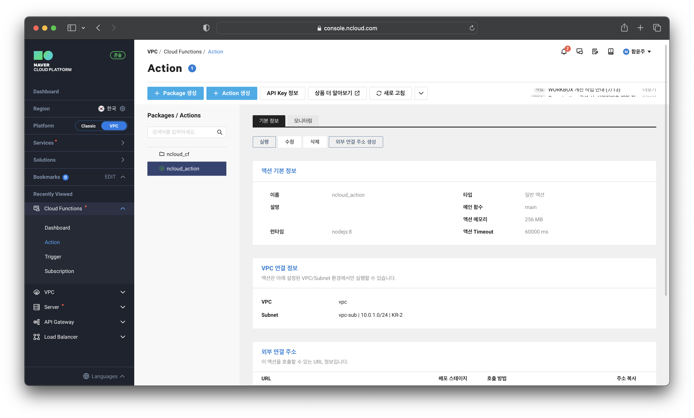
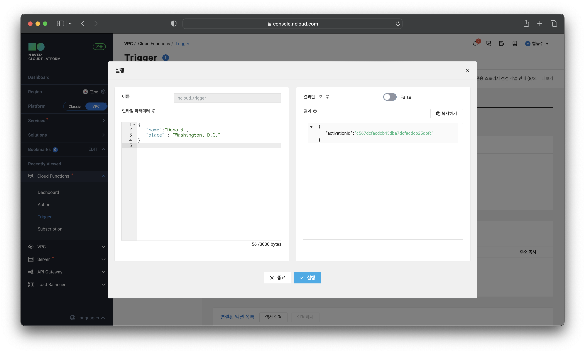
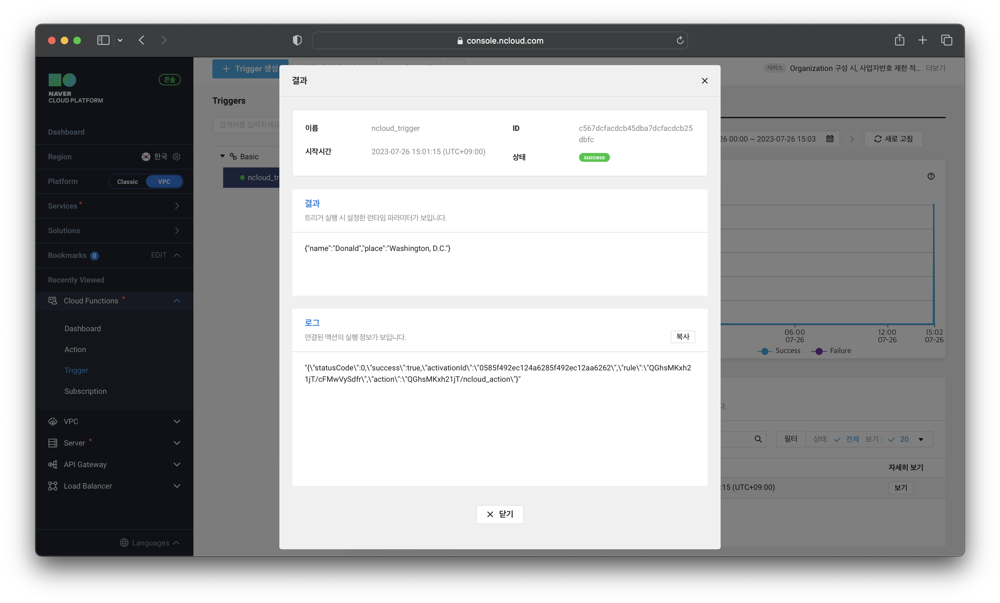
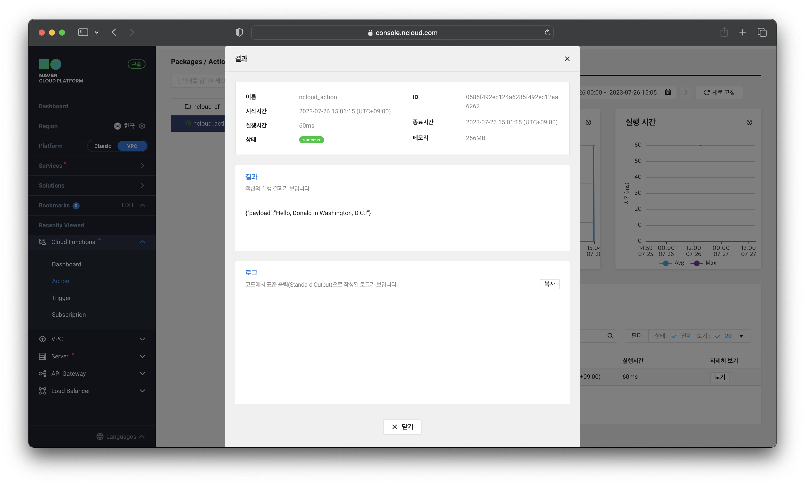

# Cloud Functions로 액션 실행

## ****서비스 신청****

### ****STEP 1. 이용약관에 동의하고 서비스 신청****

## ****Action과 Trigger 사용****

### ****STEP 1. Package 생성****

### ****STEP 2. Action과 Trigger 생성 및 연결****

### ****STEP 3. Trigger 실행****

### ****STEP 4. Trigger 실행 결과 확인****

### ****STEP 5. Action 실행 결과 확인****
