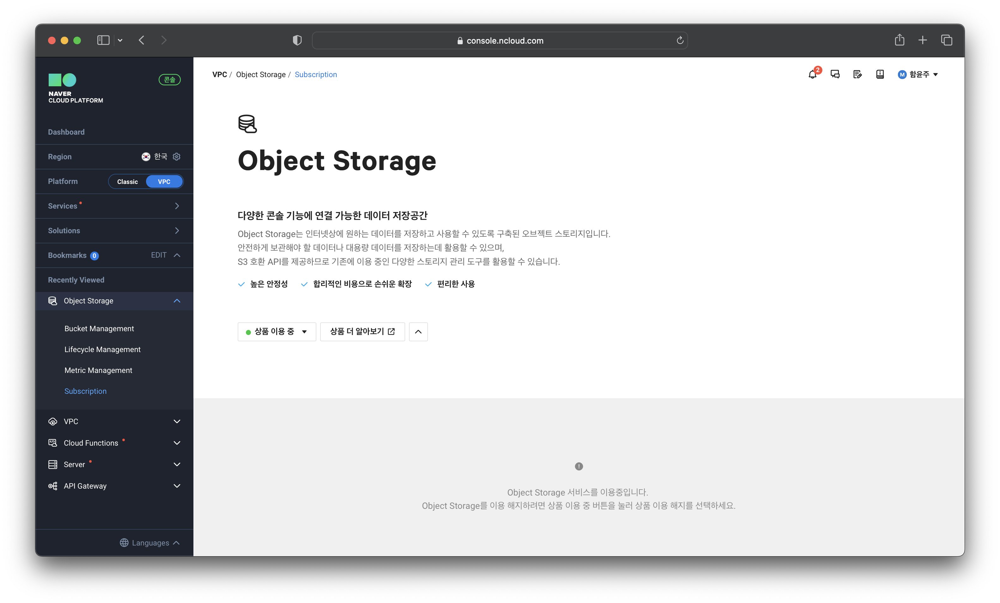
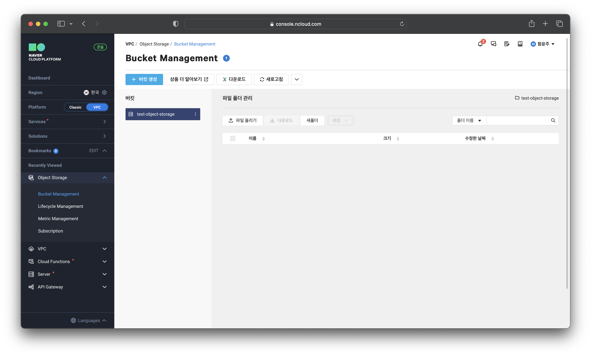
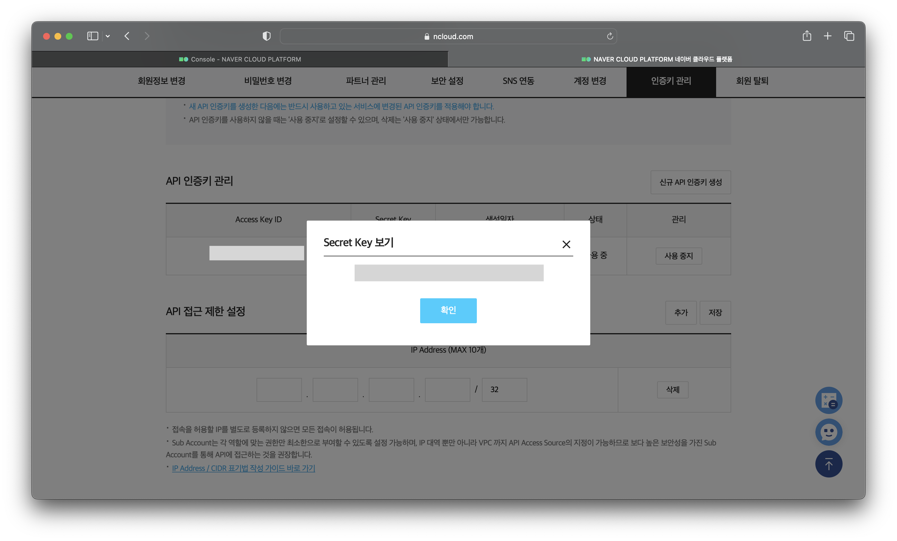
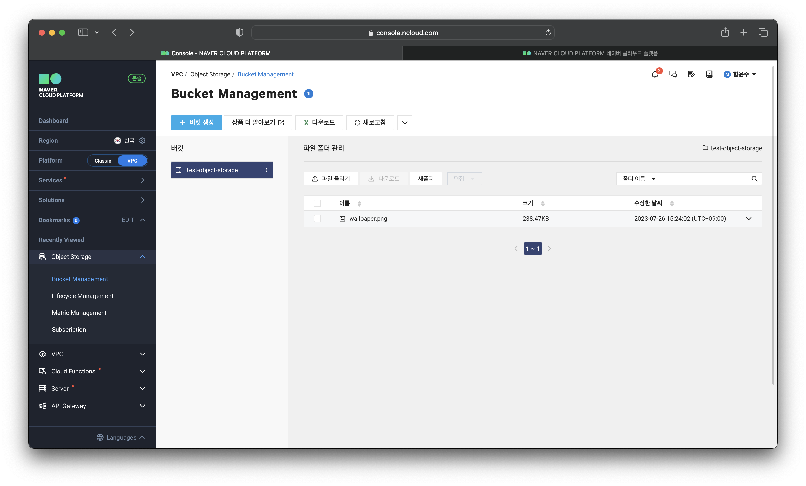
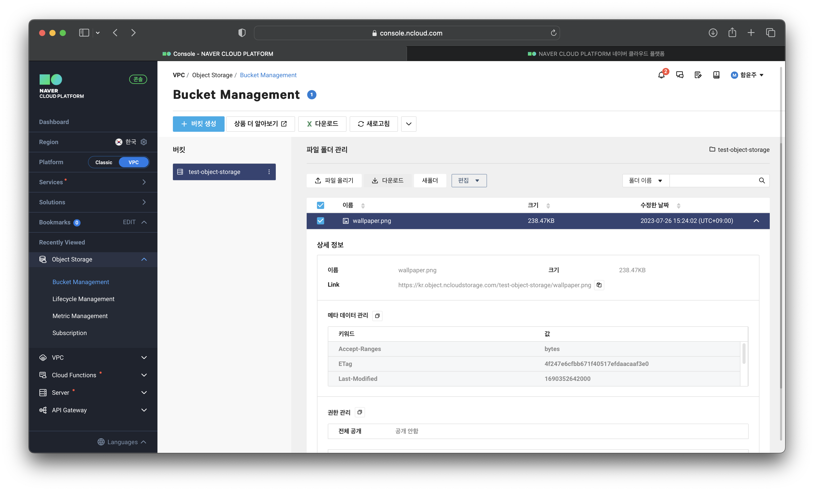
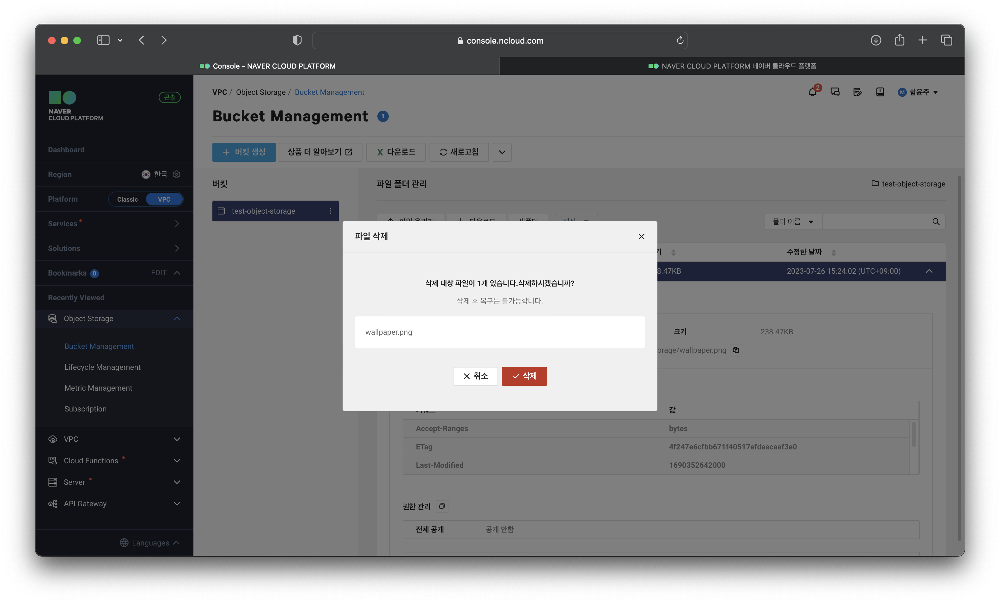
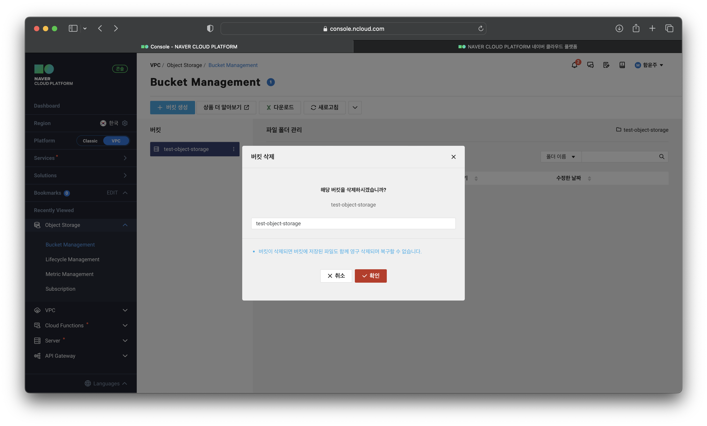

# Object Storage로 파일 업로드

## ****Object Storage 이용****

### ****STEP 1. Object Storage 이용 신청****

### ****STEP 2. Object Storage 버킷 생성****

## ****인증키 생성****

### ****STEP 1. 신규 API 인증키 생성****

## ****파일 업로드 및 다운로드****

### ****STEP 1. 파일 업로드****

### ****STEP 2. 파일 다운로드****

## ****파일 및 버킷 삭제****

### ****STEP 1. 파일 삭제****

### ****STEP 2. 버킷 삭제****
