# NAS 생성 후 마운트 (Linux)

## ****Linux 서버 생성****

### ****STEP 1. 서버 이미지 선택****

### ****STEP 2. 서버 설정****
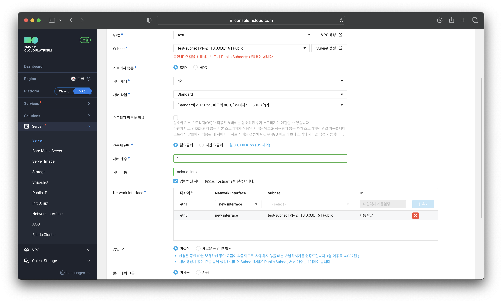

### ****STEP 3. 인증키 설정****
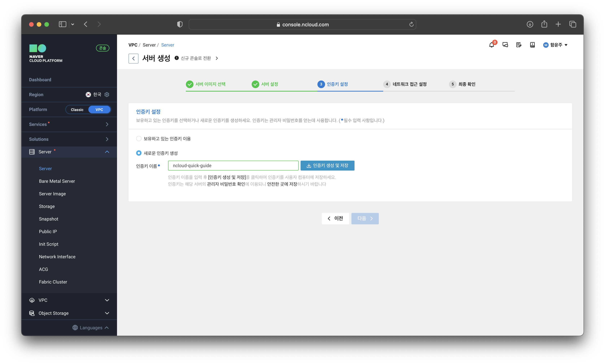

### ****STEP 4. 네트워크 접근 설정****
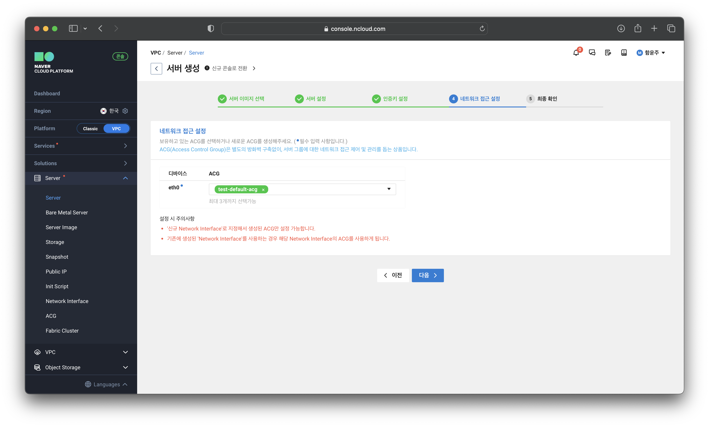

### ****STEP 5. 최종 확인****
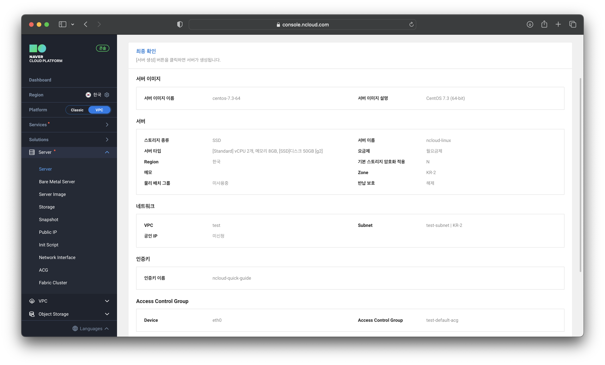

## ****서버 접속 환경 설정****

### ****STEP 1. 공인 IP 설정****
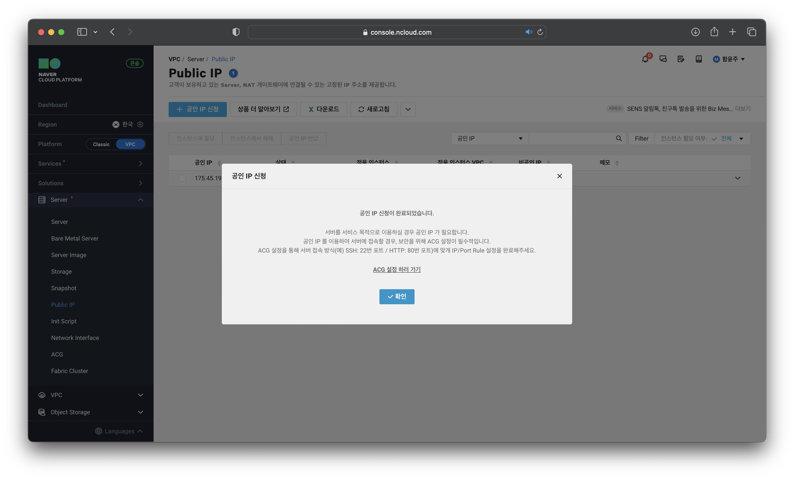

### ****STEP 2. 방화벽(ACG) 설정****
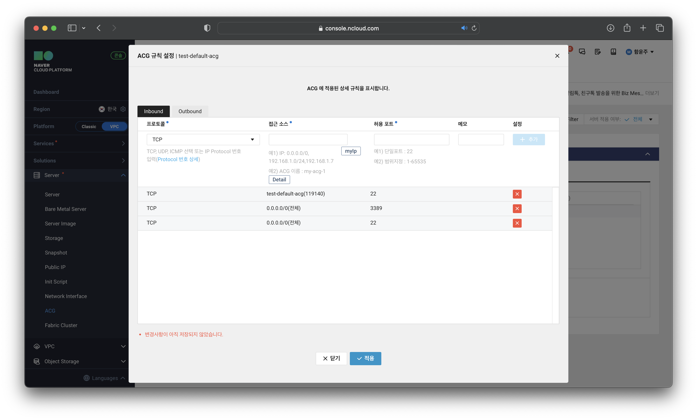

### ****STEP 3. 관리자 비밀번호 확인****

# ****서버 접속****

### ****STEP 1. 터미널 접속****
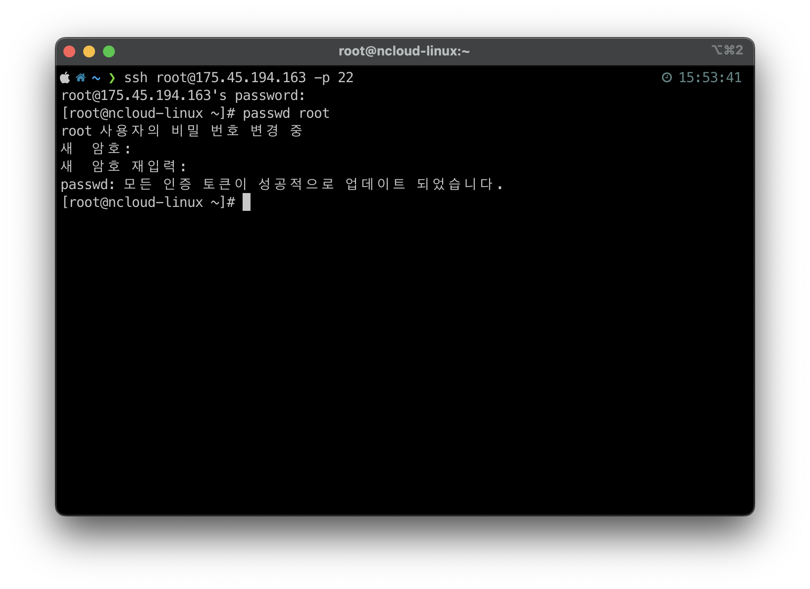

## ****NFS 볼륨 생성****

### ****STEP 1. NFS 볼륨 생성****
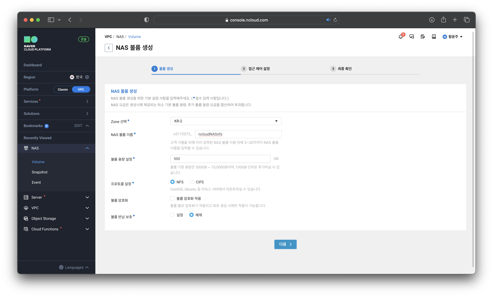

### ****STEP 2. NFS 접근 제어 설정****
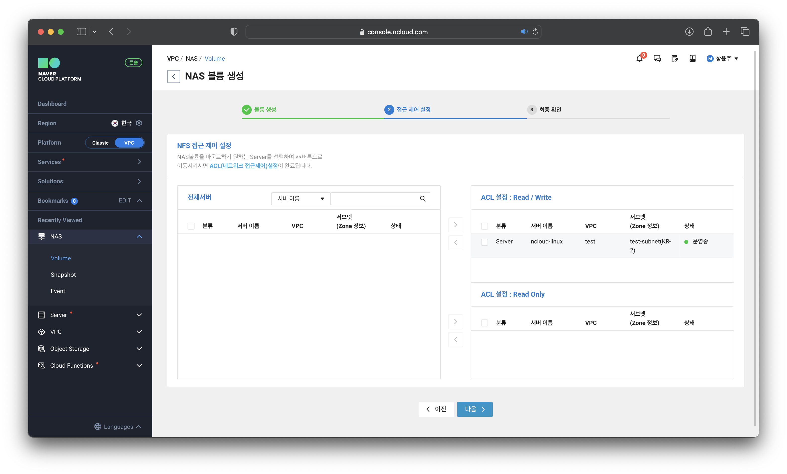

### ****STEP 3. NFS 최종 확인****
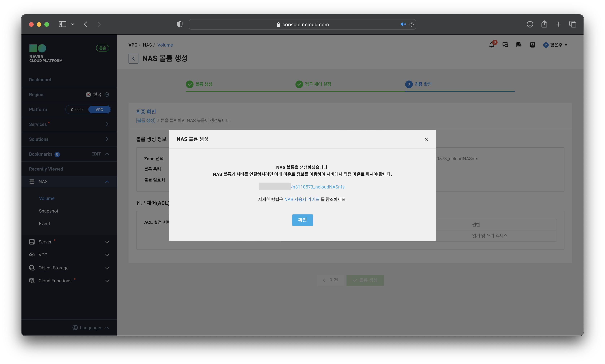

## ****NFS 마운트****

### ****STEP 1. NFS 관련 패키지 설치****
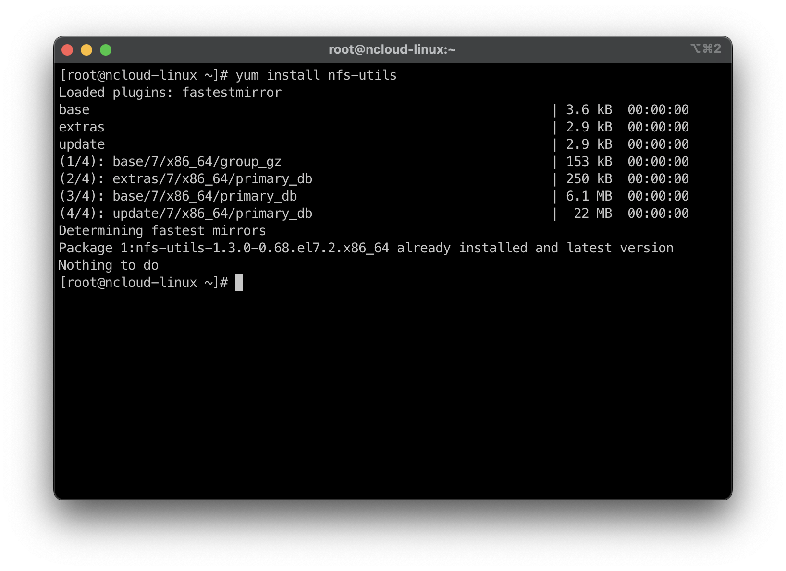

### ****STEP 2. RPC 데몬 실행****
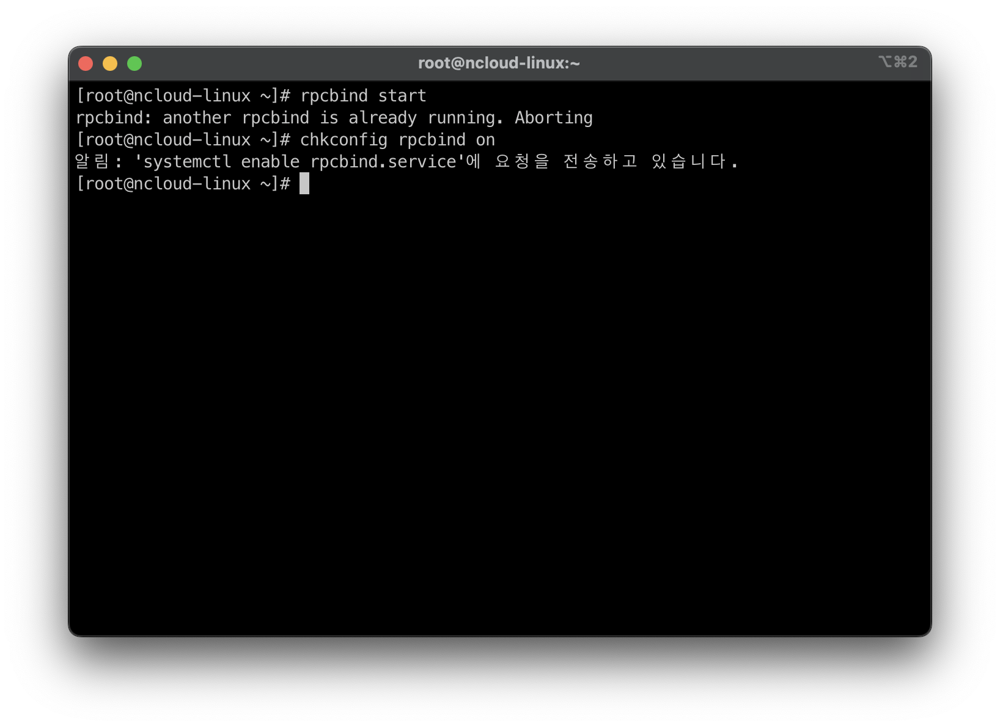

### ****STEP 3. NAS 마운트****
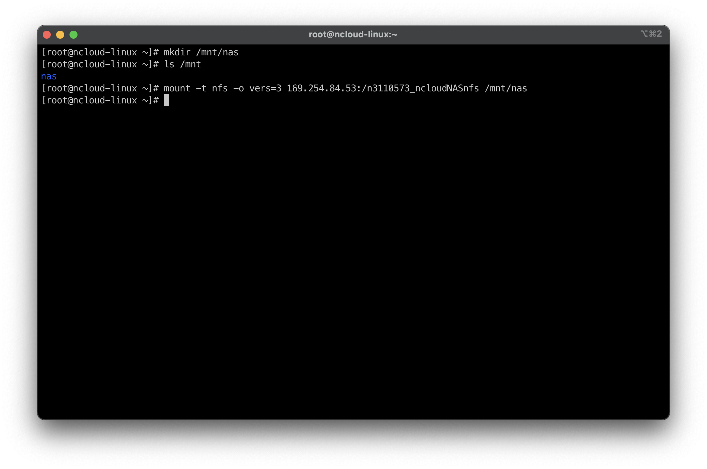

## ****NAS 볼륨 삭제****

### ****STEP 1. NAS 볼륨 삭제****
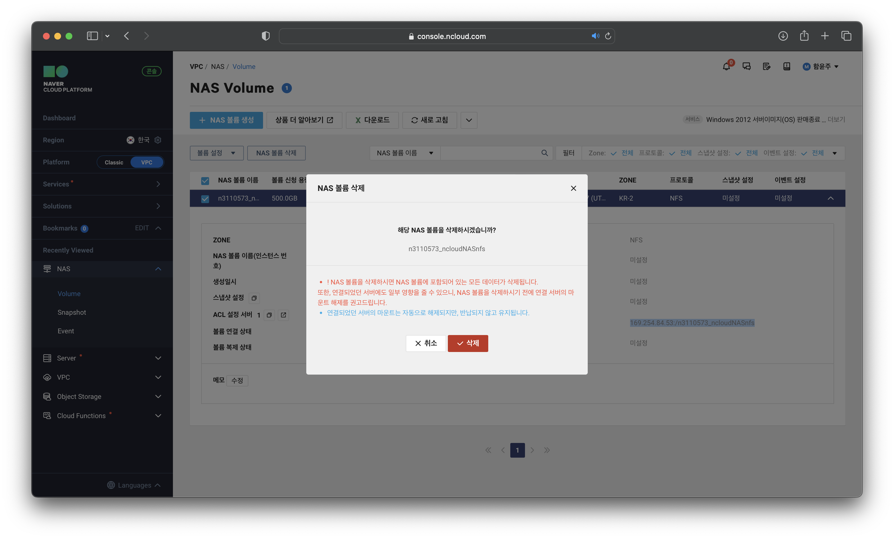

## ****Linux 서버 정지 및 반납****

### ****STEP 1. 서버 정지****

### ****STEP 2. 서버 반납****
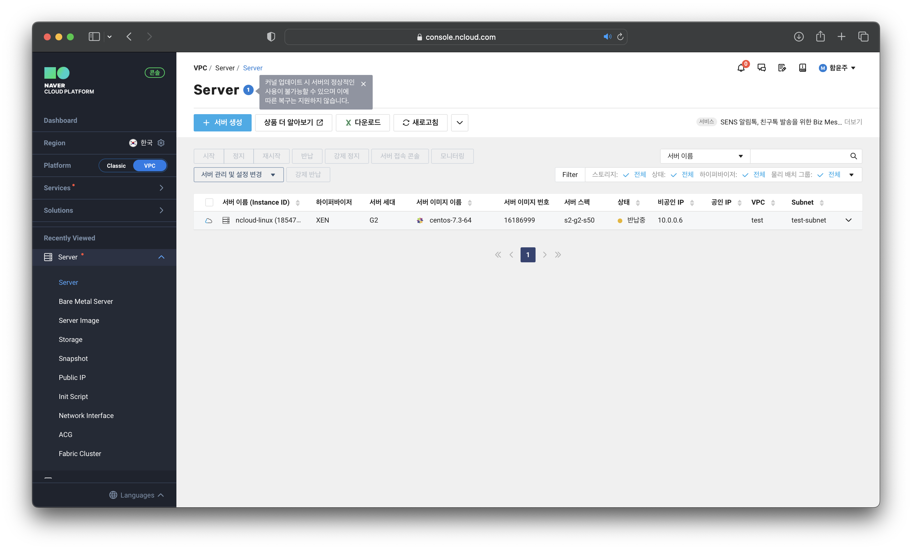