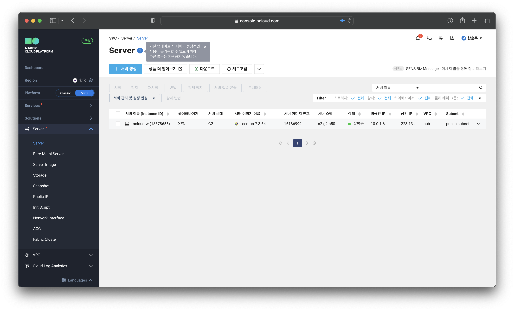
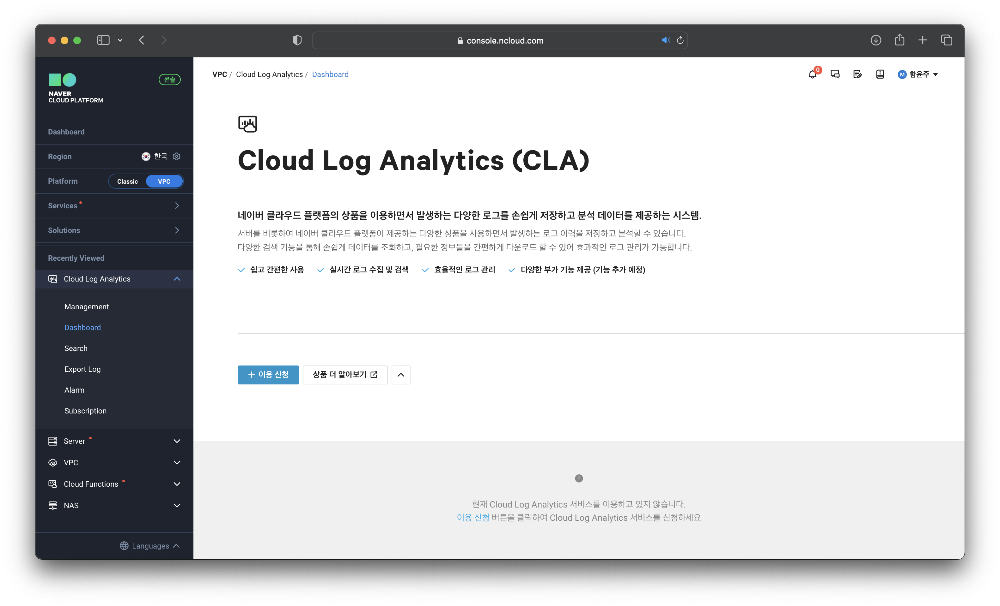
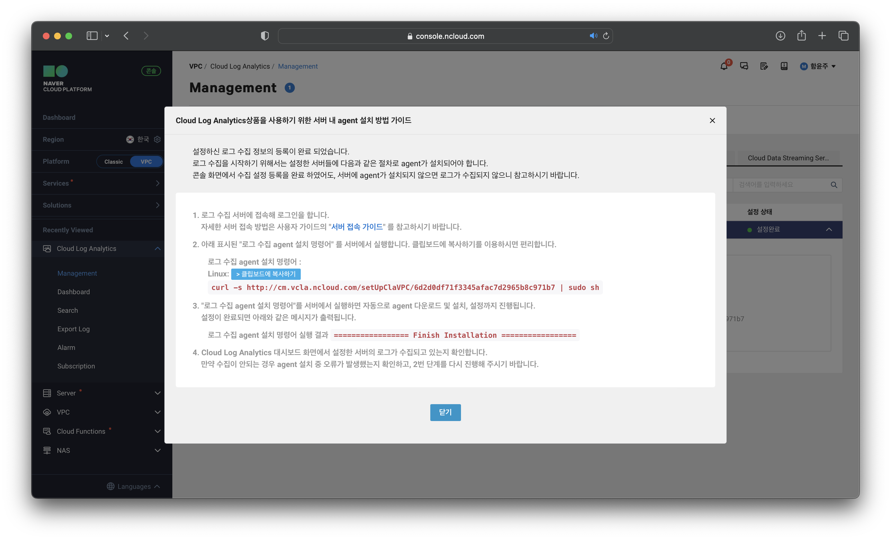
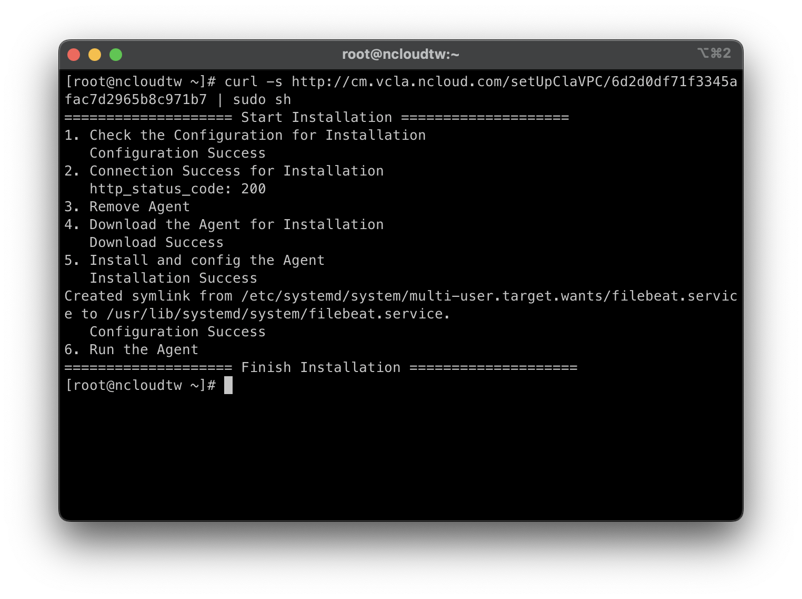
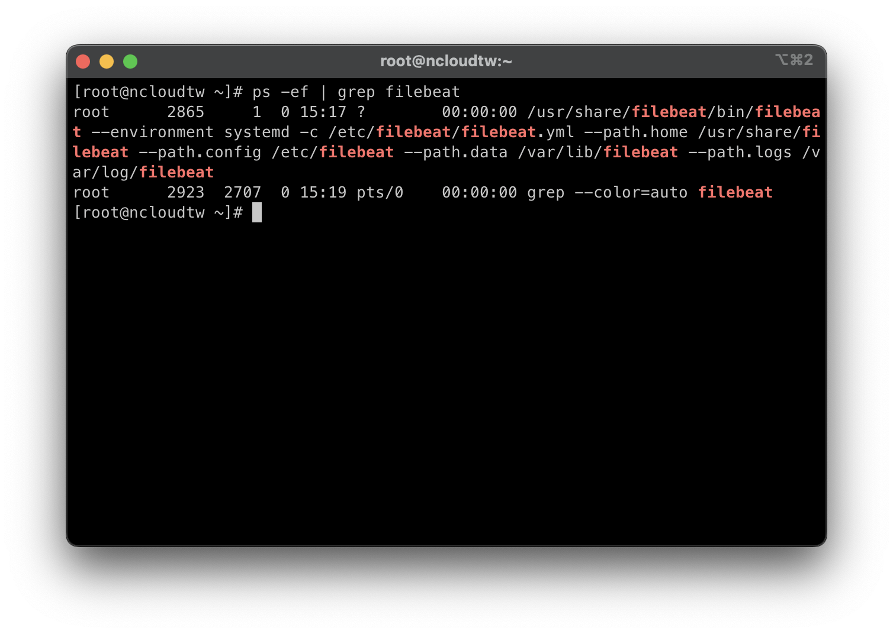
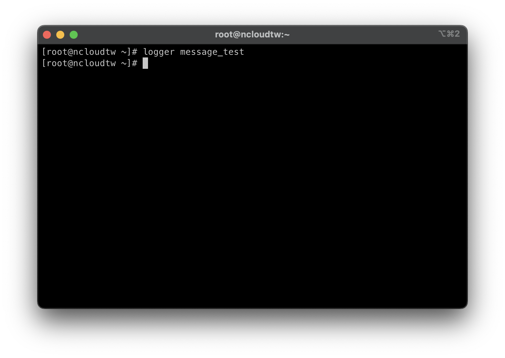
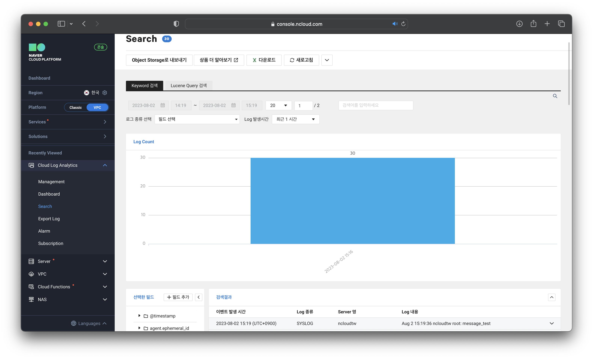
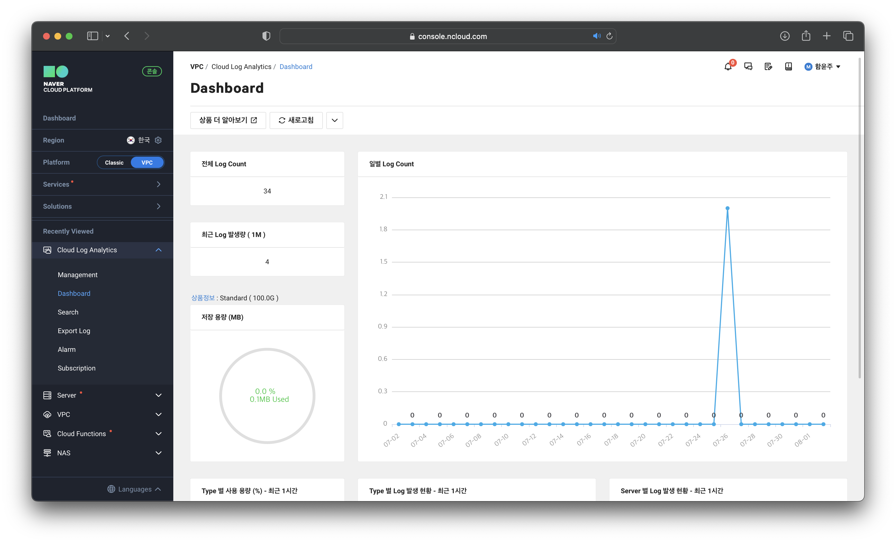
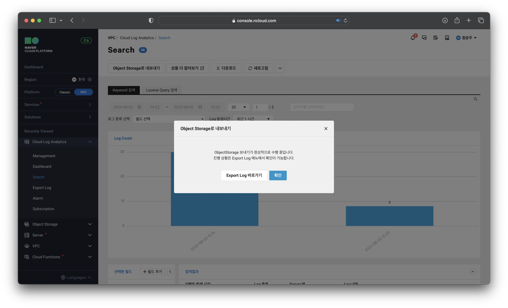
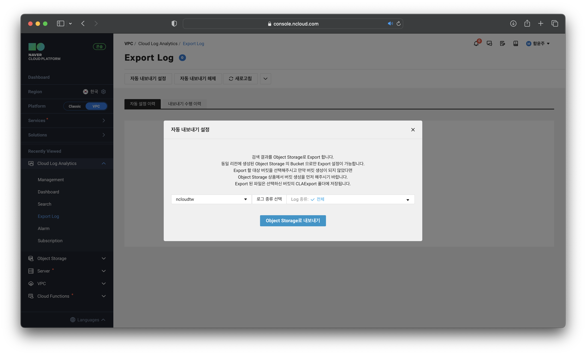

# Cloud Log Analytics로 로그 수집

## 서버 생성

### ****STEP 1. 서버 생성****

## ****Cloud Log Analytics 로그 수집 설정****

### ****STEP 1. Cloud Log Analytics 이용 신청****

### ****STEP 2. Cloud Log Analytics 로그 수집 설정****

### ****STEP 3. 로그 수집 Agent 설치****

### ****STEP 4. 로그 수집 Agent 설치 여부 확인****

### ****STEP 5. 콘솔에서 로그 정상 수집 여부 확인****

## ****Cloud Log Analytics 데이터 확인****

### ****STEP 1. Cloud Log Analytics 대시보드 확인****

### ****STEP 2. Object Storage로 내보내기****

### ****STEP 3. 로그 자동 내보내기****
