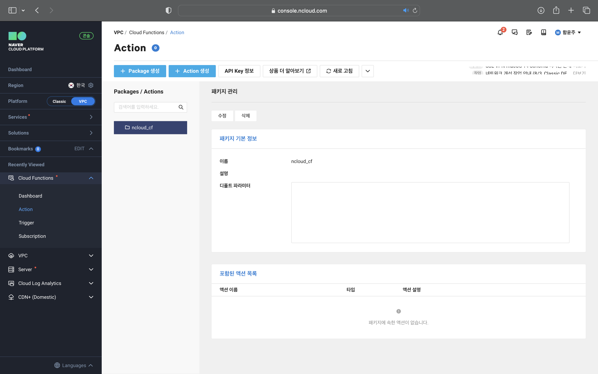
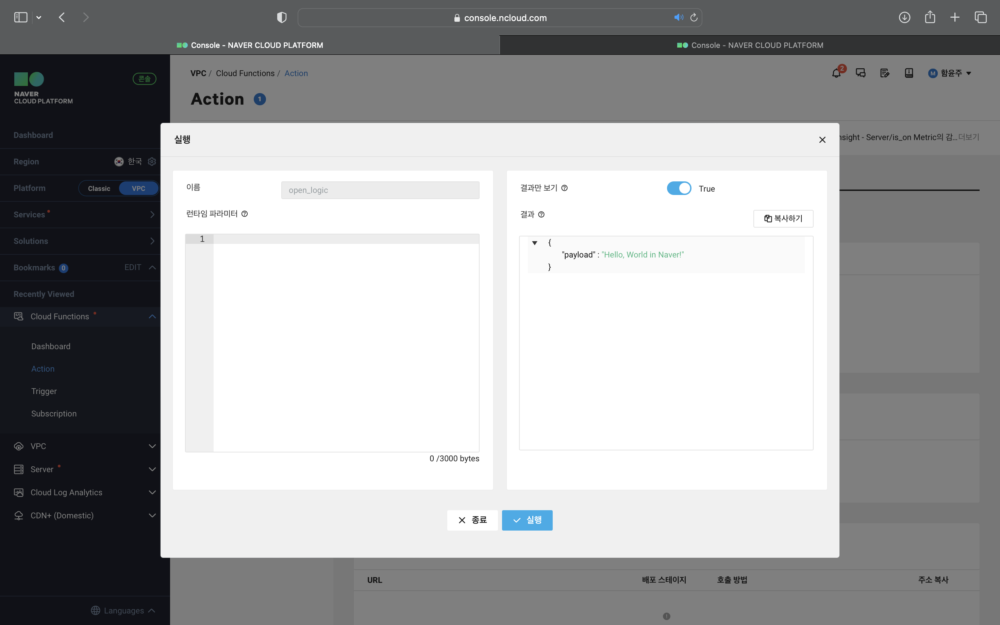
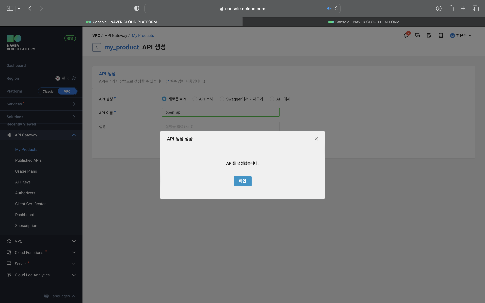
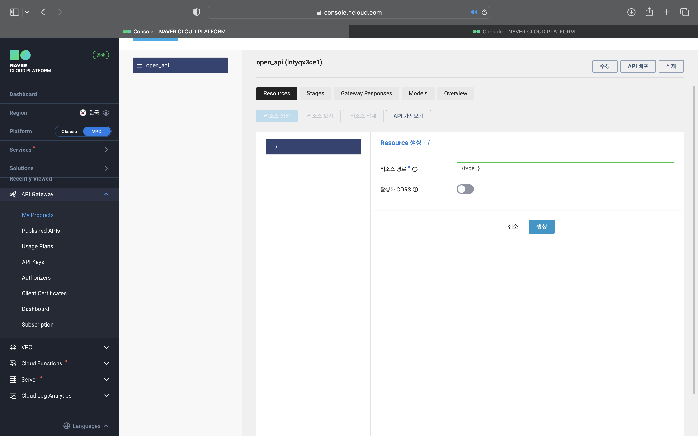
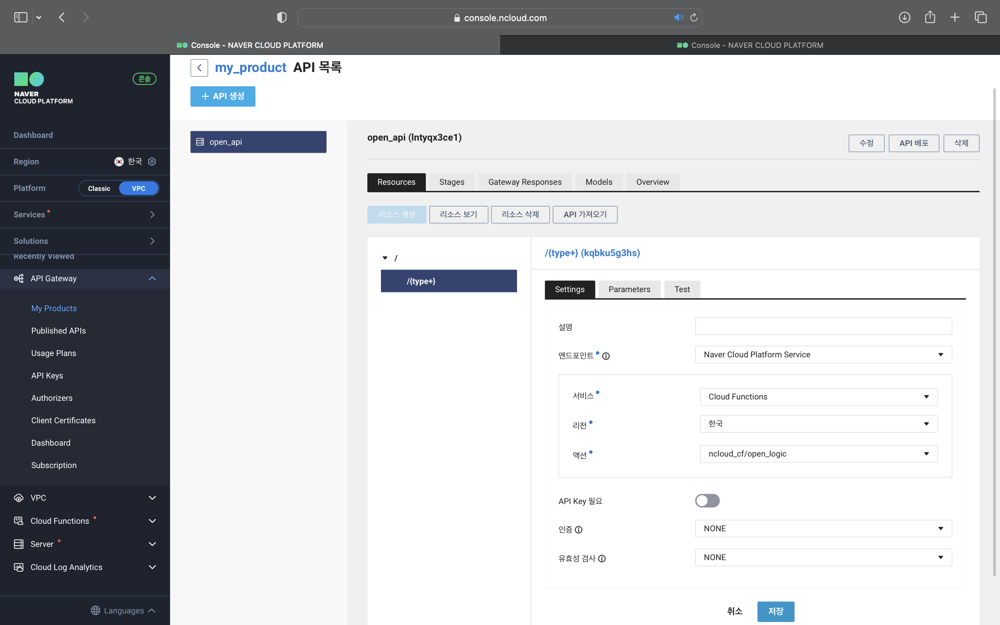
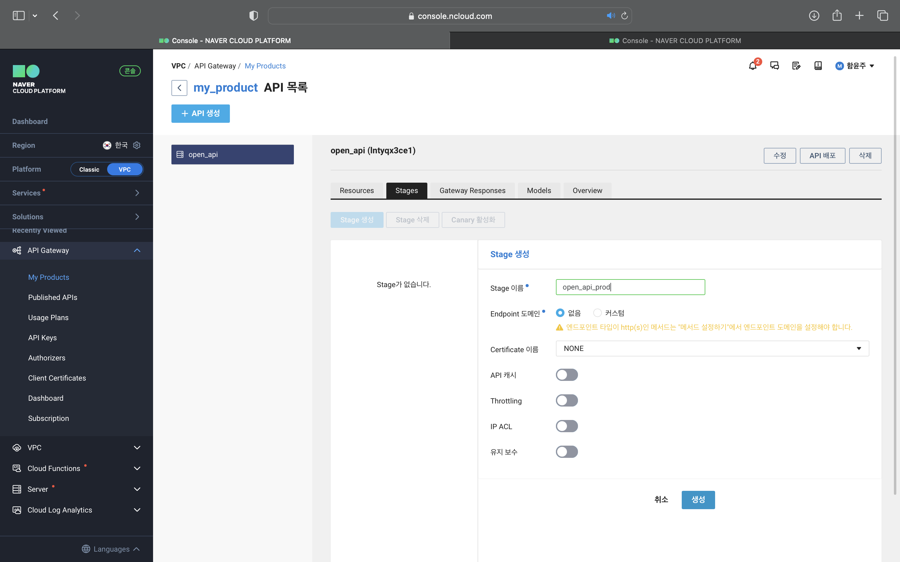
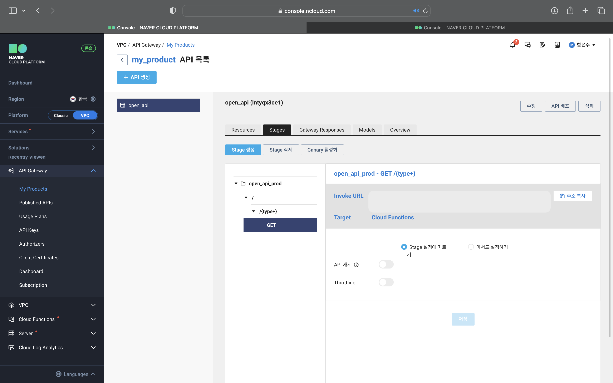
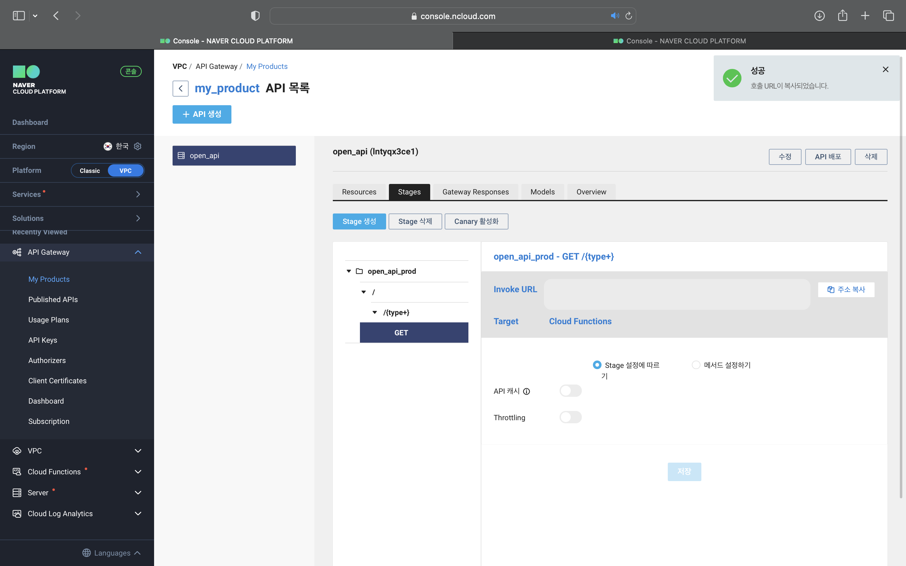

# API Gateway와 Cloud Functions를 활용한 비즈니스 로직 호출

## ****Cloud Functions 생성****

### ****STEP 1. Package 생성****

### ****STEP 2. Action 생성****

### ****STEP 3. Action 실행****

## ****API Gateway 생성****

### ****STEP 1. My Product 생성****

### ****STEP 2. API 생성****

### ****STEP 3. 리소스 생성****

### ****STEP 4. 리소스 생성 및 엔드포인트 지정****

### ****STEP 5. Stage 생성****

### ****STEP 6. Stage에 API 배포****

### ****STEP 7. 호출 URL 주소 확인 및 복사****

### ****STEP 8. API를 이용해 비즈니스 로직 실행****
