# 서브 계정 활용

## ****서브 계정 생성****

### ****STEP 1. 서브 계정 추가****
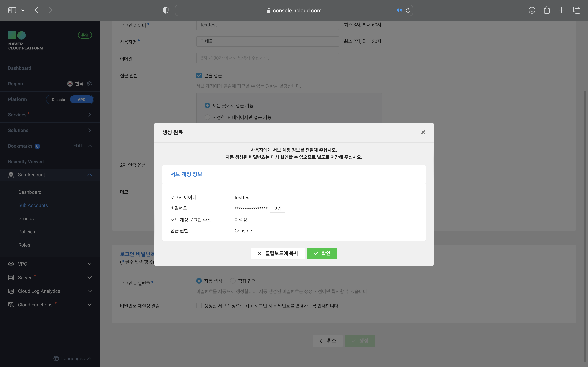

### ****STEP 2. 서브 계정에 정책 추가****
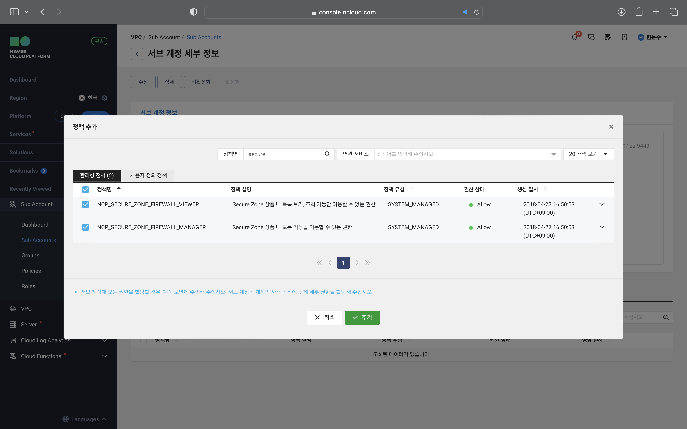

## ****STEP 3. 서브 계정 로그인 페이지 생성****
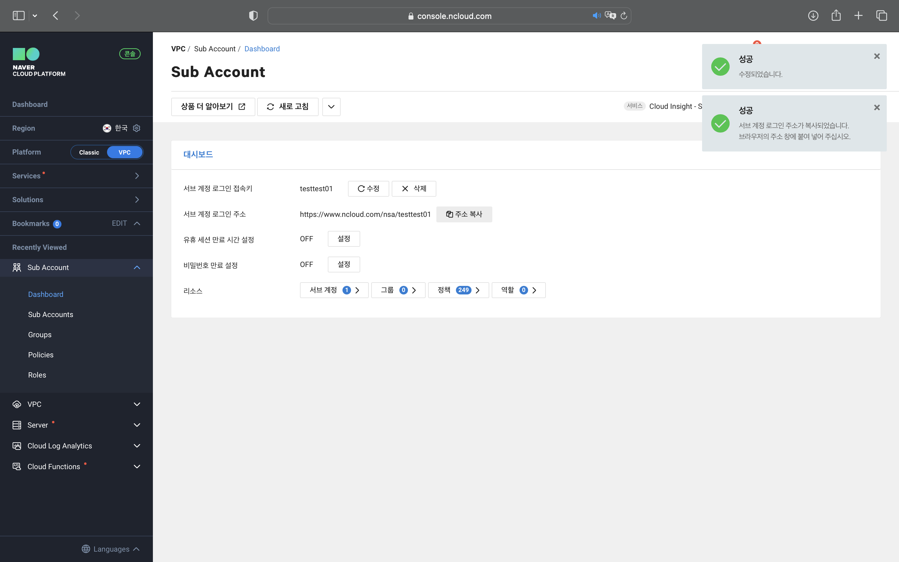

## ****서브 계정 정보 관리****

### ****STEP 1. 서브 계정 정보 수정****
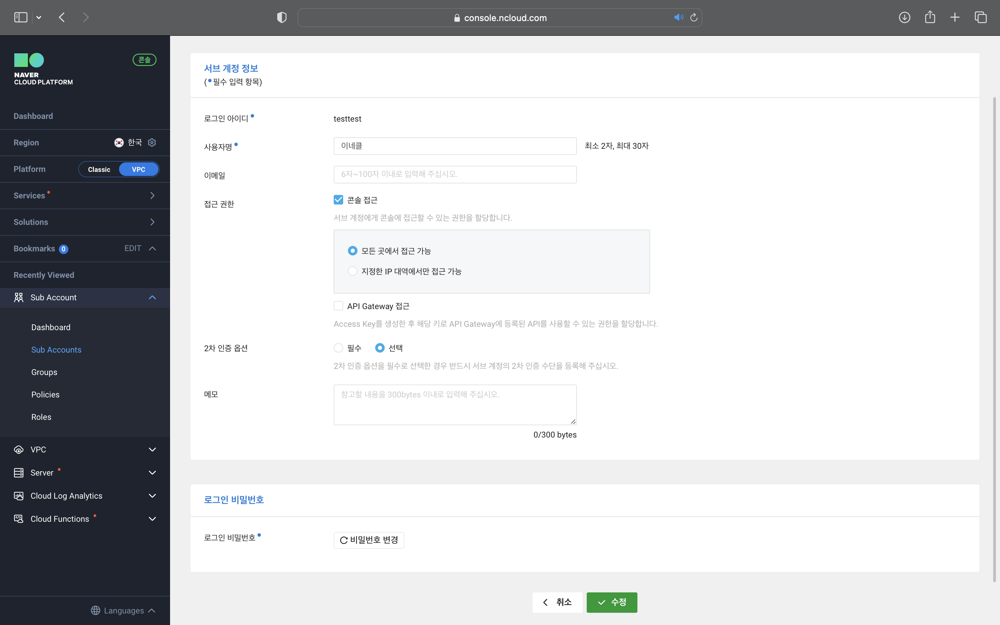

### ****STEP 2. 서브 계정이 접근 가능한 IP대역 수정****
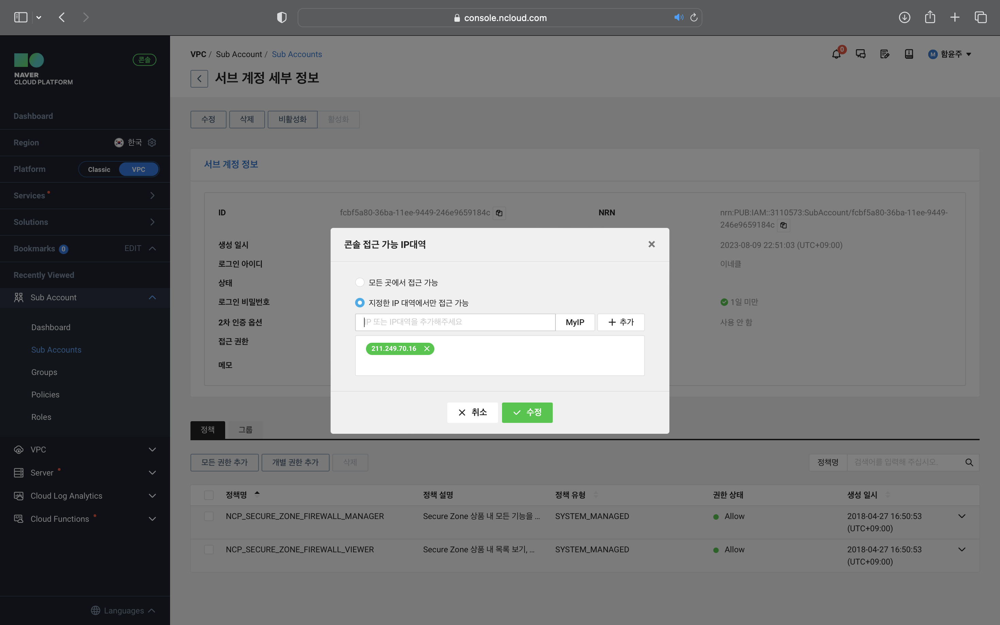

### ****STEP 3. 서브 계정 비밀번호 변경****

### ****STEP 4. 서브 계정 일시 정지****
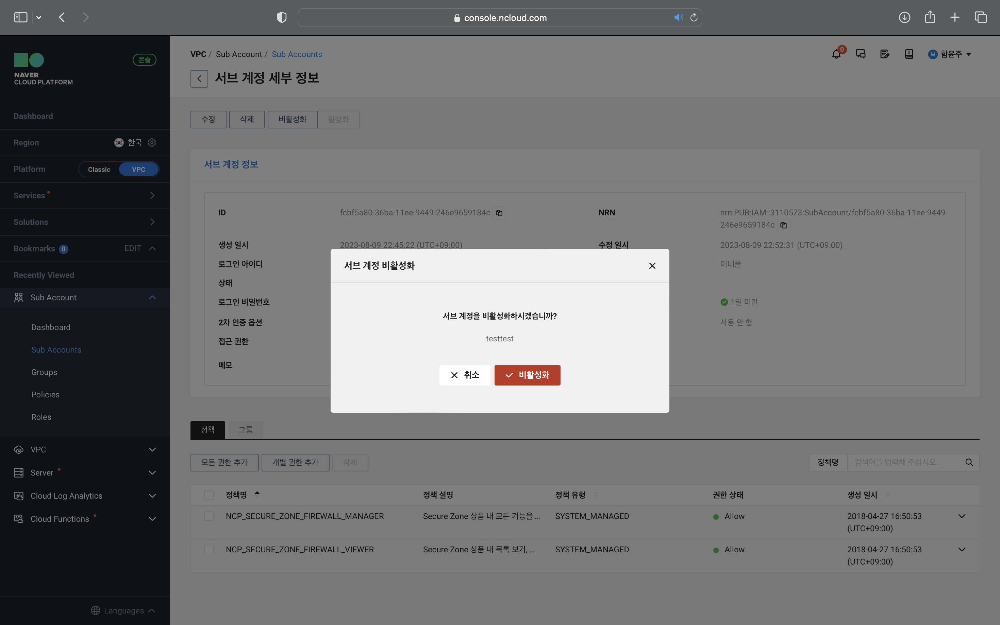

### ****STEP 5. 서브 계정 삭제****
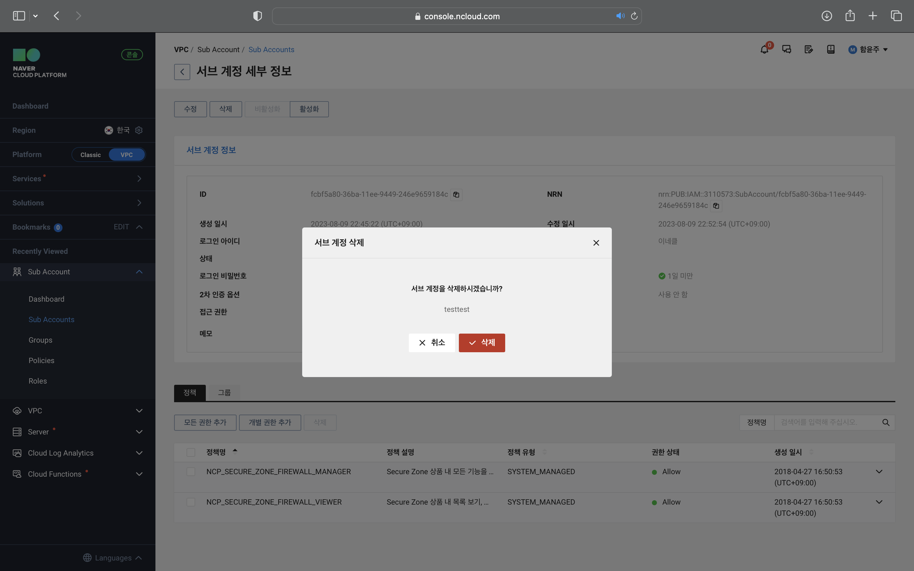

## ****User Created 정책 관리****

### ****STEP 1. 정책 생성****

### ****STEP 2. 정책 수정****
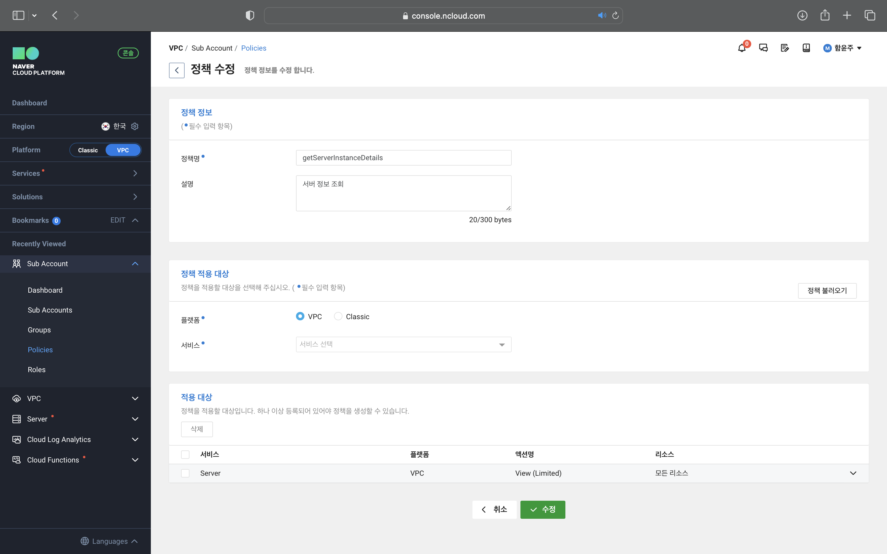

### ****STEP 3. 정책 삭제****
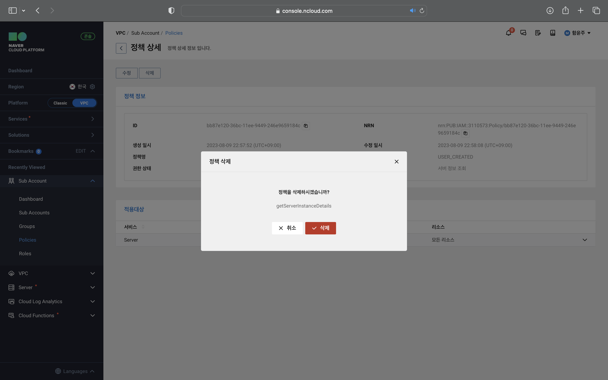

## ****Role 관리****

### ****STEP 1. Role 생성****
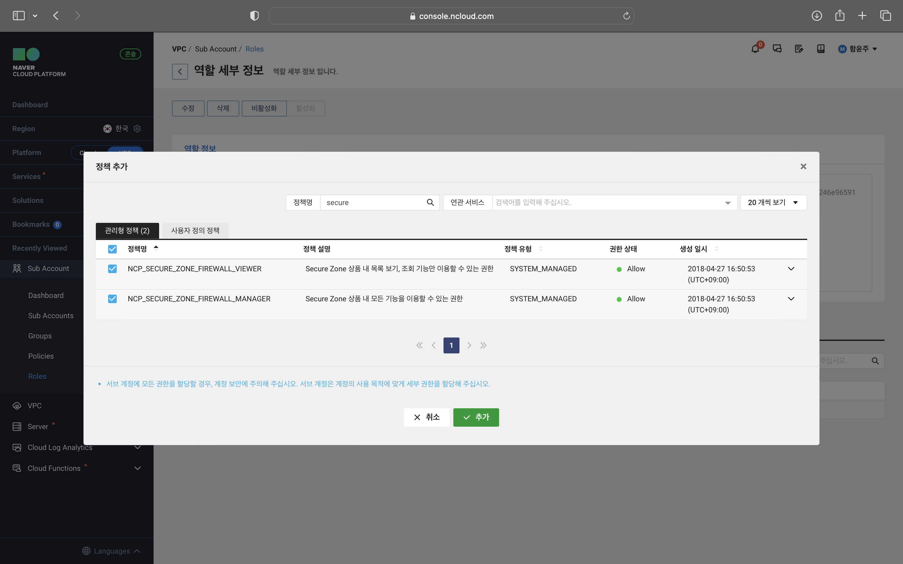

### ****STEP 2. Role 정보 수정****
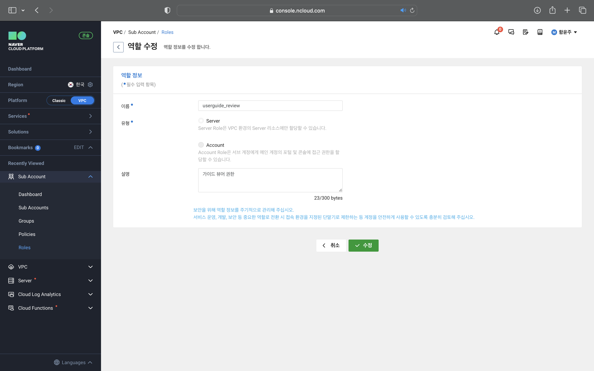

### ****STEP 3. Role 삭제****
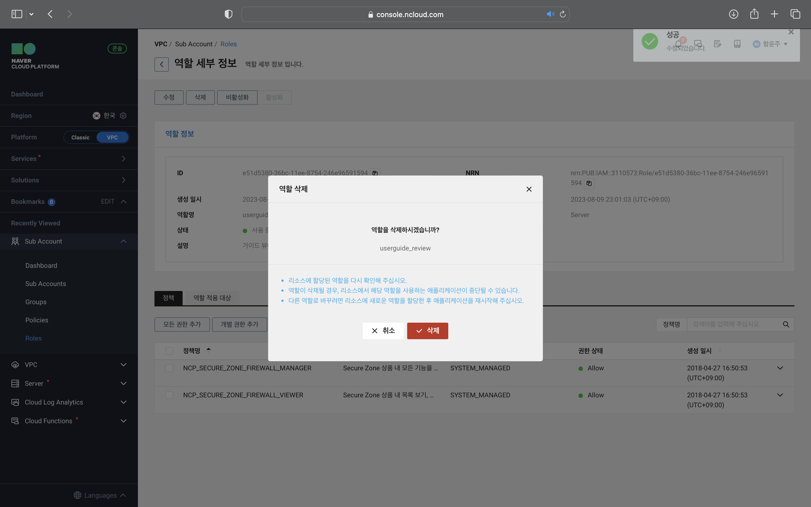

## ****서브 계정으로 로그인****

### ****STEP 1. 서브 계정 로그인 주소에 접속****
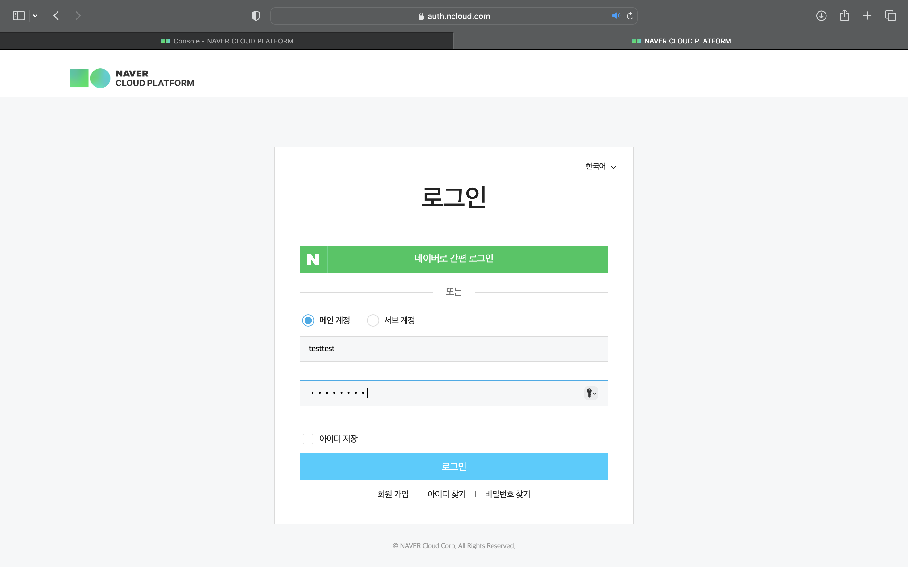

### ****STEP 2. 2차 인증 정보 설정****
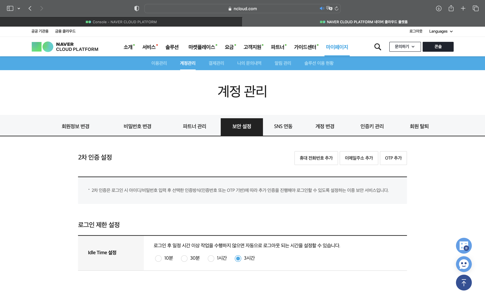