# FAQ 챗봇 제작

## ****도메인 생성****

### ****STEP 1. 도메인 생성****
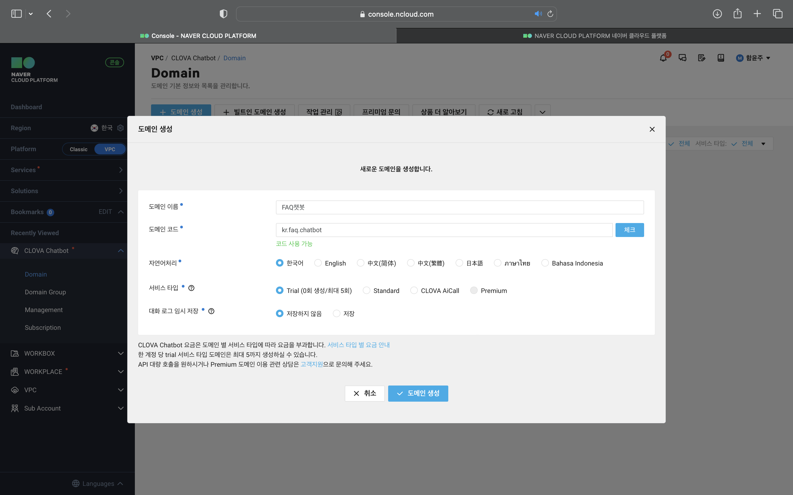

### ****STEP 2. 챗봇 빌더 접속****
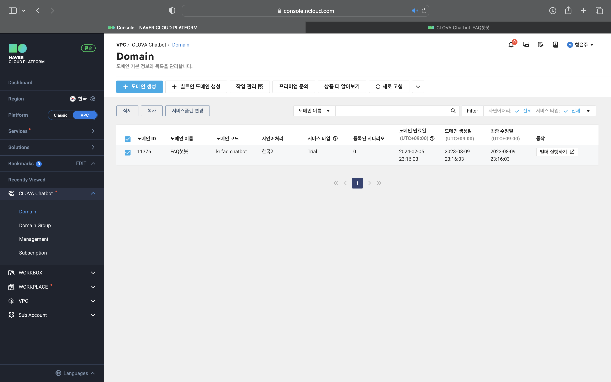

## ****공통 메시지 생성****

### ****STEP 1. 웰컴 메시지 등록****
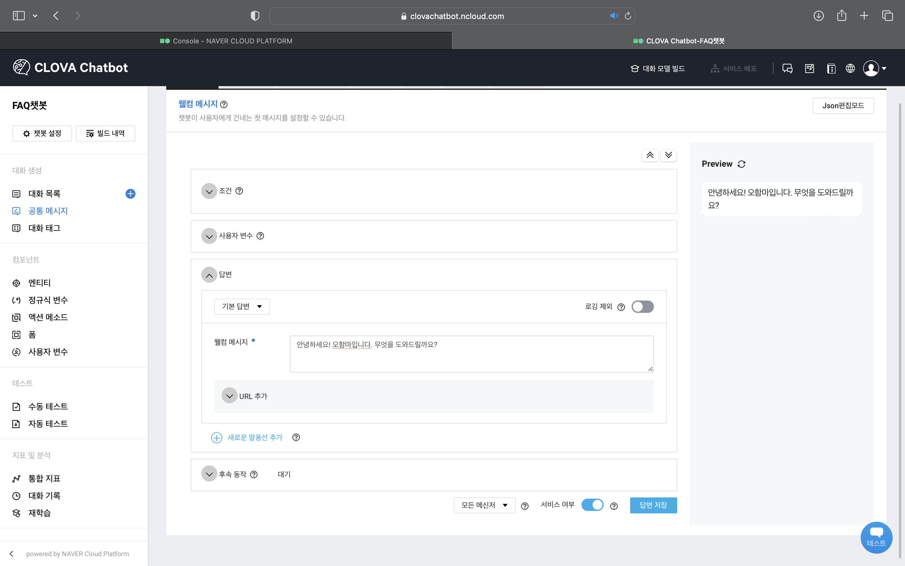

### ****STEP 2. 실패 메시지 등록****
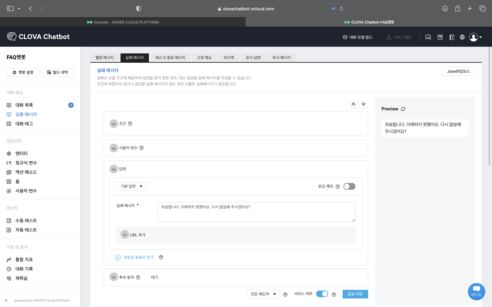

## ****대화 생성****

### 대화 등록

#### ****STEP 1. 대화 정보 입력****
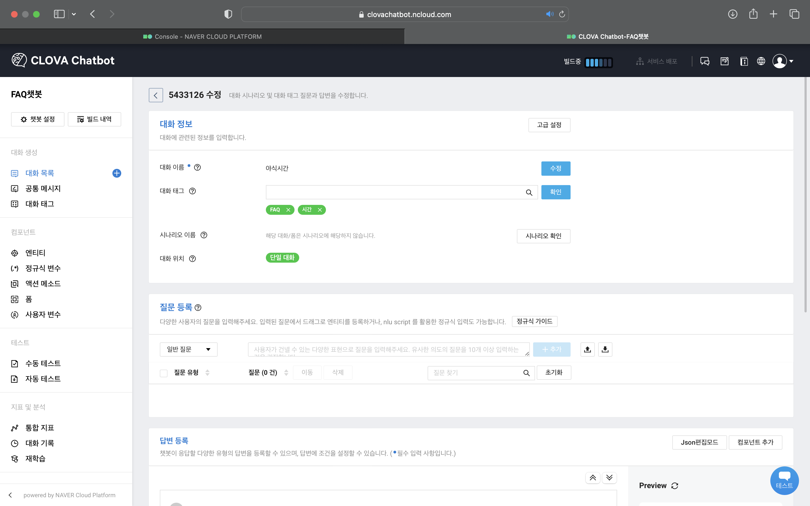

#### ****STEP 2. 질문 입력****
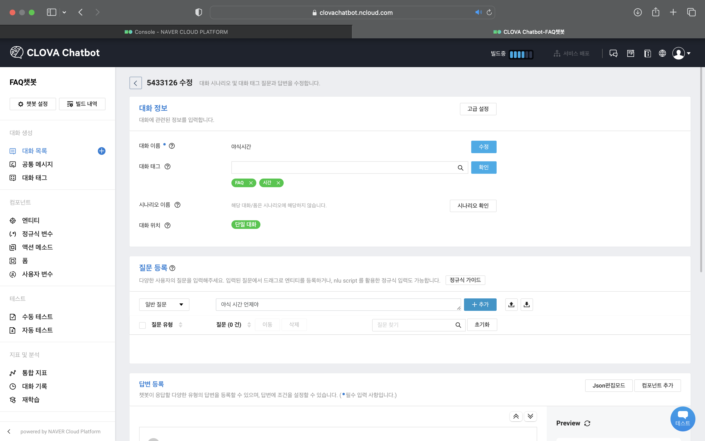

#### ****STEP 3. 답변 입력****
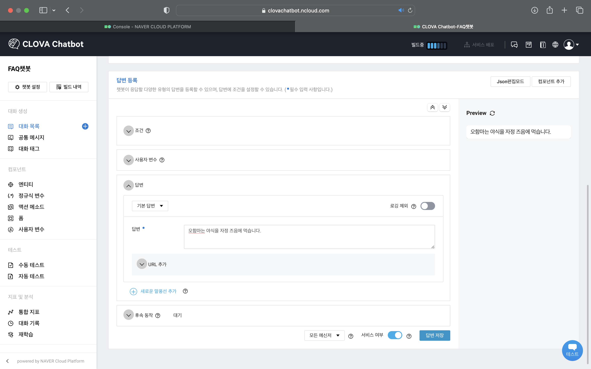

### 대화 일괄 등록

#### ****STEP 1. 질문 파일 제작****
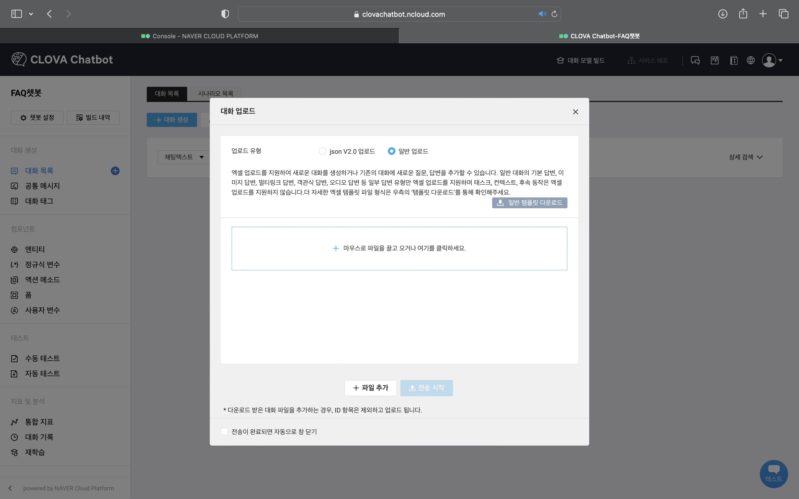

#### ****STEP 2. 질문 파일 업로드****
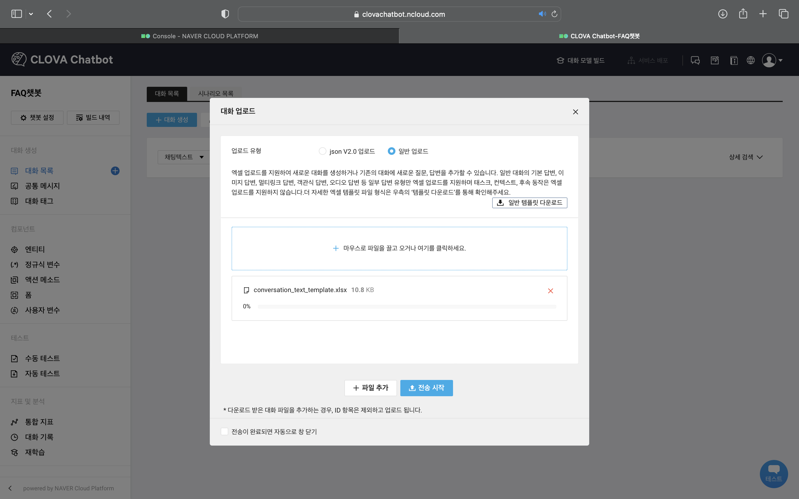

## ****대화 빌드****

### ****STEP 1. 대화모델 빌드****
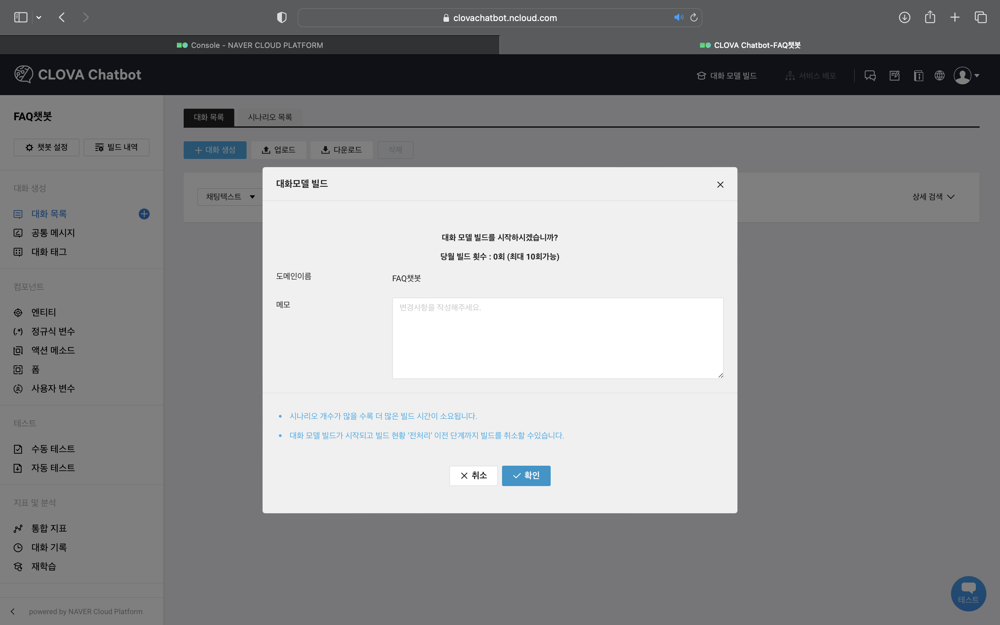

### ****STEP 2. 빌드 진행 상황 확인****
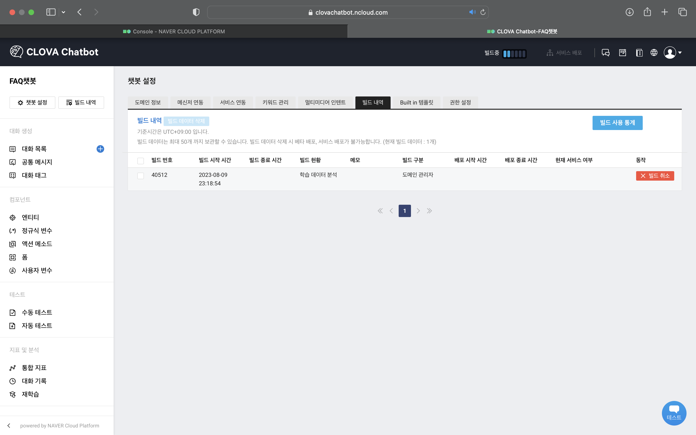

## ****테스트****

### ****STEP 1. 테스트****
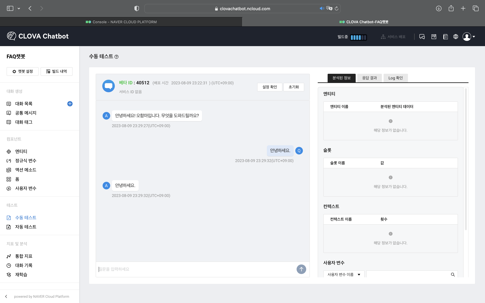