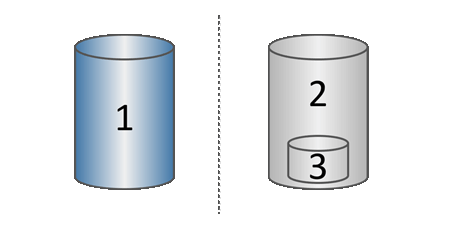

# 발표

# 스냅샷

스냅샷이란? 특정 시간의 저장 장치의 상태를 보존

COW(Copy-On-Write)

1 : 기본 볼륨(물리 디스크 용량)

2 : 스냅샷(논리적 디스크 용량)

3 : 예약된 용량(물리 디스크 용량)

백업과의 비교 : 

저장 공간을 덜 차지함

빠르게 생성 가능

단기 스토리지에 이상적

시스템을 이전 상태로 복원

원본 데이터 종속성 - 원본의 저장공간에 오류가 발생할 경우 복구 불가

객체 수준의 복구 불가능

# 쿠버네티스

## 개념

**컨테이너** : 앱이 구동되는 환경까지 감싸서 실행할 수 있도록 하는 격리 기술

특정 경로/컴퓨터에 필요한 옵션 등 환경을 모두 포함하여 실행할 수 있도록 함

**컨테이너** **런타임** : 컨테이너를 다루는 도구

**도커** : 컨테이너를 다루는 도구 중 가장 유명한 것

**쿠버네티스** : 컨테이너 런타임을 통해 컨테이너를 오케스트레이션 하는 도구

**오케스트레이션** : 여러 서버에 걸친 컨테이너 및 사용하는 환경 설정을 관리하는 행위

컨테이너를 분산해서 배치하거나, 문제가 생긴 컨테이너를 교체하거나, 컨테이너가 사용할 비밀번호나 환경 설정을 관리하고 주입하는 일 등

애플리케이션 배포 환경의 변화

**전통적 배포 방식** : 물리적인 컴퓨터 한 대, 하나의 OS, 여러 가지 프로그램 설치

→ 단점 : 프로그램 간에 동작을 간섭하거나, 특정 프로그램이 성능을 독점하여 다른 프로그램의 성능이 떨어지는 경우가 있음.

**가상화 배포** : 가상머신을 기반으로 배포

하이퍼바이저 : 하나의 시스템에서 가상 컴퓨터를 여러 개 구동할 수 있도록 해 주는 중간 계층

→ 장점 : 서로 간섭 x, 가상머신의 성능을 조절해 CPU나 메모리 할당량 조절 가능.

서버는 다중화와 분산 처리가 중요한 시스템이므로 자원 상황에 따라 가성머신 개수를 늘리고 줄이는 것을 더 유연하게 처리할 수 있다는 장점도 있음

가상머신마다 운영체제를 설치해야 하기 때문에 무거운 편

**컨테이너 중심 배포** : 하이퍼바이저 → 컨테이너 런타임, 가상머신 → 컨테이너

OS 하단은 상관 X(가상머신 위에서도 가능)

각각의 프로그램 간에 간섭을 일으킬 수 없는 장벽. CPU, 메모리 등의 자원도 독립적으로 할당하고 관리.

OS 커널을 공유하는 가상화

## 구성 요소

컨트롤 플레인 컴포넌트 : 전체적인 기능 제어 담당

kube-apiserver : 쿠버네티스 클러스터로 들어오는 요청을 가장 앞에서 처리. 적절한 컴포넌트로 요청을 전달.

etcd : 클러스터 및 리소스의 구성 정보, 상태 정보 및 명세 정보 등을 저장

kube-scheduler : 새로 생성된 파드(작업 단위)를 감지하여 어떤 노드로 배치할 지 결정(스케줄링)

kube-controller-manager : 관리

노드 컴포넌트 : 컨트롤 플레인 컴포넌트의 요청을 받아 각 노드에서 동작을 담당

kubelet : 노드에서 컨테이너가 동작하도록 관리. 각 노드에서 파드를 생성하고 정상적으로 동작하는지 관리

container runtime : 파드에 포함된 컨테이너 실행을 실질적으로 담당하는 애플리케이션. 컨테이너 런타임 인터페이스(CRI)를 준수하여 쿠버네티스와 함께 사용할 수 있는 외부 애플리케이션.

kube-proxy : 쿠버네티스 클러스터 내부에서 네트워크 요청을 전달. 파드 IP는 매번 바뀜. 외부에서 파드로 접근할 수 있는 경로 제공.

[쿠버네티스 알아보기 1편: 쿠버네티스와 컨테이너, 도커에 대한 기본 개념 | 인사이트리포트 | 삼성SDS (samsungsds.com)](https://www.samsungsds.com/kr/insights/220222_kubernetes1.html)

[쿠버네티스 알아보기 2편: 쿠버네티스를 만나는 여러 가지 방법 | 인사이트리포트 | 삼성SDS (samsungsds.com)](https://www.samsungsds.com/kr/insights/kubernetes-2.html)

[쿠버네티스 알아보기 3편: 쿠버네티스를 이루고 있는 여러 가지 구성 요소 | 인사이트리포트 | 삼성SDS (samsungsds.com)](https://www.samsungsds.com/kr/insights/kubernetes-3.html)