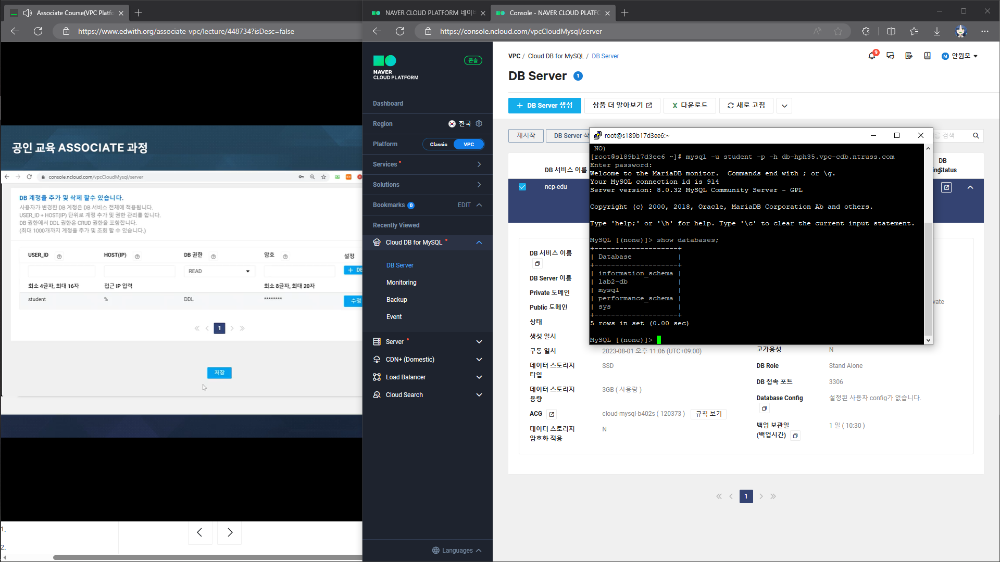

## 13강 : 완전 관리형 서비스 Cloud DB 소개

Cloud DB for MySQL

자동 Fail-Over 지원 및 사용자 환경에 맞는 구성 가능

루트에 대한 권한 x(공통)

최대 5대까지 복제 Slave(Read Only)

Master DB Failover : 수동 Failover

DB Process 모니터링

Stand Alone 백업

멀티존 지원 : 서버 2개를 서로 다른 Zone에 생성

Cloud DB for Redis

자동 복구를 통해 안정적으로 운영되는 완전 관리형 클라우드 인메모리 캐시 서비스

자동 Fail-over 기능 독자 개발하여 제공

Redis Cluster 미지원 → 지원(VPC)

샤드 최소 3개

HA 구성 지원

Cloud DB for MS-SQL

네이버에서 최적화된 설정 제공

## 14강 : Cloud DB For MySQL 생성 및 접속 데모

## 15강 : 네이버클라우드플랫폼 AI/Application 서비스 소개

AI

Clova, Papago

Application

Geolocation

사용자 IP를 통해 위치 정보를 제공하는 서비스

SENS

SMS, APP Push

Outbound Mailer

대량 메일 발송

챗봇

Clova Speech Recognition

음성을 텍스트로 변환

Clova Speech

긴 음성을 인식하고 텍스트 추출

Clova Speech Synthesis

합성음 제공

Clova Voice

텍스트를 자연스러운 음성으로 변환

Clova Dubbing

컨텐츠에 나레이션 추가하는 기능

Clova Face Recognition

1) 유명인 얼굴 인식, 2) 얼굴 감지

Clova OCR

템플릿 기능

데이터를 추출하고 데이터베이스화

Papago NMT

통계 기반 번역

Pose Estimation

이미지내의 주요 신체 영역을 인식하고 해당 영역을 좌표로 변환

Object Detection

이미지내의 객체를 탐지하고 객체를 분석

Search Trend

네이버 통합검색 서비스 조회 결과에 대한 통계 API

nShortURL

길고 복잡한 URL을 간단하고 짧게 변경하는 API

## 16강 : Cloud Outbound Mailer 활용 데모

